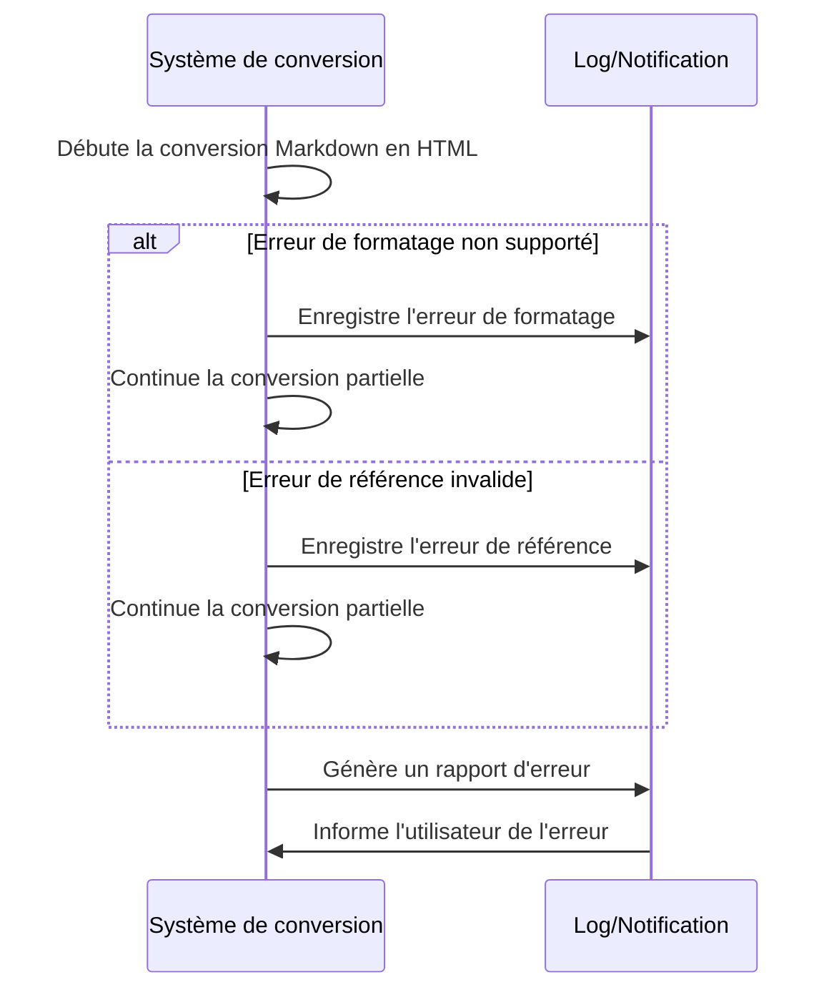

# **Gestion des Erreurs de Conversion**

## Résumé
Pendant la conversion d'une note de Markdown à HTML, le système de conversion (script Python) rencontre soit un formatage Markdown non supporté, soit une référence de ressource invalide. Le système doit alors gérer l'erreur de manière appropriée, en informant l'utilisateur de l'erreur rencontrée et, lorsque cela est possible, en procédant à une conversion partielle de la note.

## Acteurs en jeu
- **Système de conversion (script Python)** : L'outil qui réalise la conversion des notes et gère les erreurs de conversion.

## Prérequis
- Le script de conversion est installé et configuré pour convertir les notes Markdown en HTML.
- Les notes Markdown à convertir sont accessibles par le script.

## Étapes du scénario
1. Le script de conversion démarre le processus de conversion d'une note spécifiée par l'utilisateur ou détectée par un système de surveillance.
2. Pendant la conversion, le script rencontre l'un des deux problèmes suivants :
   a. Un élément de formatage Markdown qui n'est pas supporté par le script.
   b. Une référence de ressource (comme une image ou un document PDF) qui est invalide (par exemple, le fichier est manquant ou l'URL est incorrecte).
3. Le script enregistre les détails de l'erreur et continue la conversion des parties de la note qui ne sont pas affectées par l'erreur.
4. À la fin de la conversion, le script génère un rapport d'erreur ou envoie une notification à l'utilisateur, détaillant le problème rencontré et, si applicable, indiquant les parties de la note qui n'ont pas été converties.
5. L'utilisateur reçoit l'information sur l'erreur et peut prendre les mesures nécessaires pour corriger le problème dans la note originale.

## Diagramme de séquence Mermaid

Ce diagramme illustre le processus suivi par le système de conversion lorsqu'une erreur est rencontrée pendant la conversion d'une note Markdown en HTML. Il met en évidence la capacité du système à gérer de manière proactive les erreurs en informant l'utilisateur et en procédant à une conversion partielle lorsque cela est possible, assurant ainsi que l'utilisateur est bien informé et peut prendre les mesures nécessaires pour corriger les problèmes identifiés.