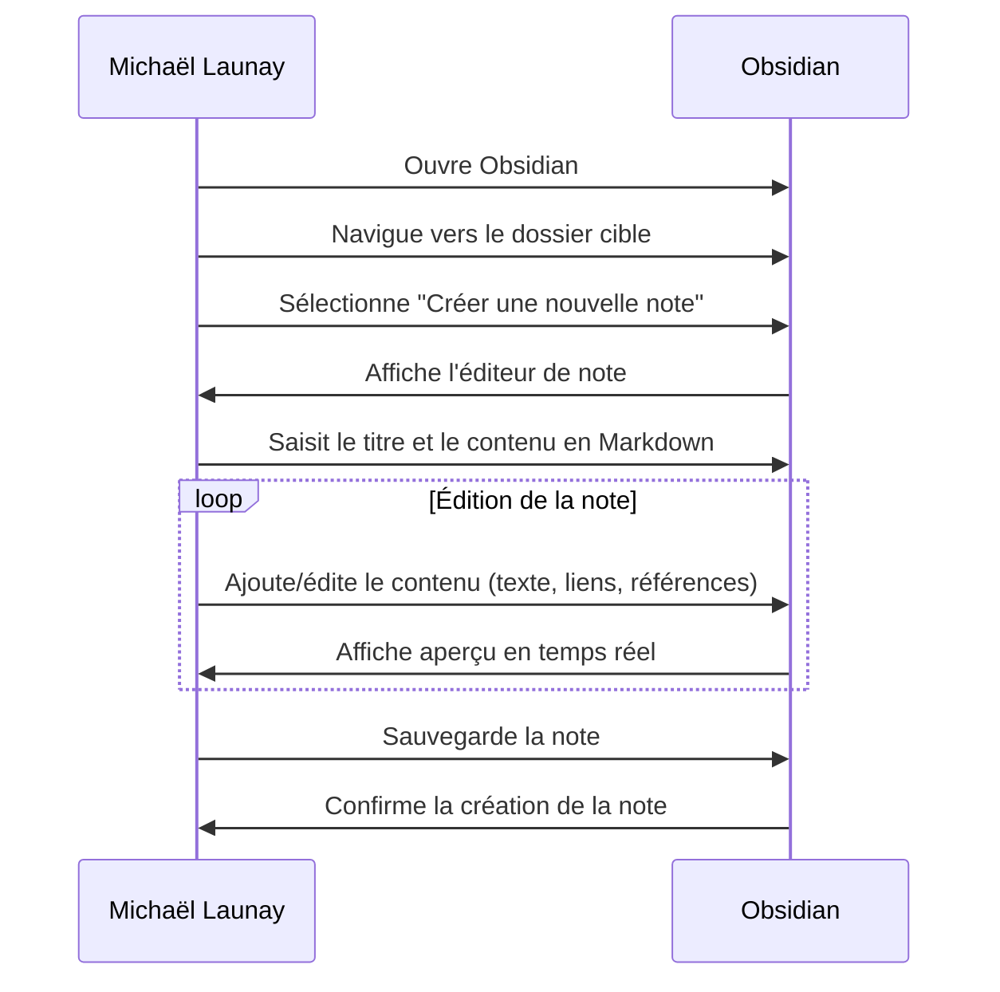
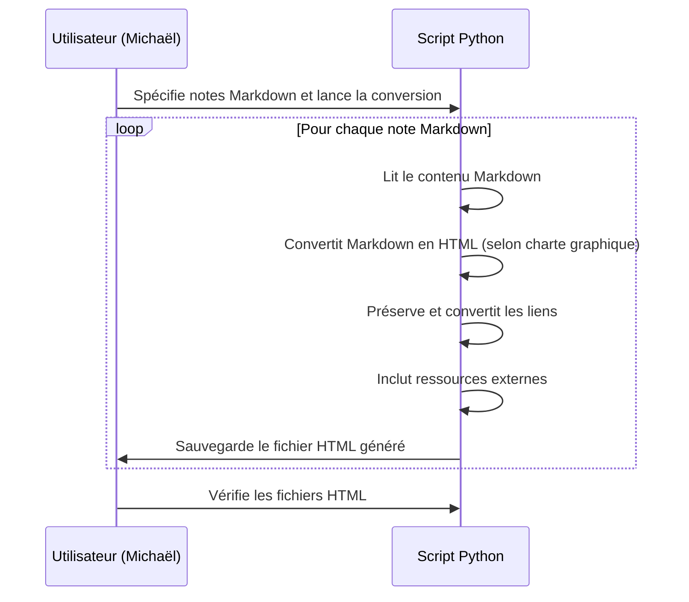

# Retranscription de l'analyse faite avec Chat GPT
## Génération du glossaire métier

**Moi**
Prend le rôle d'un développeur python sous ubuntu 24.02, nous allons développer une petite application qui satisfait le cahier des charges suivant : 
```md
# Cahier des charges Michaël Launay possède de nombreuses notes écrites en [[Markdown]] (le même format utilisé par ChatGPT pour ses réponses aux prompts que nous lui soumettons via le web) avec le logiciel de prise de notes [[Obsidian]]. Ces notes sont dans un répertoire sur son ordinateur appelé Notes. Un sous-ensemble des notes de ce répertoire est archivé dans un dépôt de code source public et gratuit appelé GitHub (un outil proposé par Microsoft où l'on peut partager son code, mais aussi tout type de documents tant que l'ensemble fait moins de 2Go, cela avec l'outil [[git]]). Les notes de ce dépôt sont donc accessibles depuis le web et peuvent être consultées par tous, c'est d'ailleurs parmi elles, dans le répertoire "cours", que se trouvent tous les cours de Michaël Launay. L'URL est https://github.com/michaellaunay/NotesPubliques. Comme on peut le voir, ce dépôt n'est pas très "glamour", même si `GitHub` affiche les notes avec un minimum de mise en forme. Nous souhaitons donc écrire un script Python qui permet de convertir ces notes en HTML et génère un site propre, "responsive". Bien sûr, le script doit garder le mécanisme de liens propre à Obsidian, et gérer les différents types de ressources (image, PDF, etc.). Nous souhaitons aussi avoir une charte graphique cohérente.
```
Pour cela nous allons d'abord analyser ce cahier des charges, en réalisant un glossaire métier

**Chat GPT**
Pour développer une application répondant à ce cahier des charges sous Ubuntu 24.02, nous devons d'abord comprendre et définir clairement les termes et concepts clés mentionnés. Voici un glossaire métier pour vous aider à démarrer :

### Glossaire métier

- **Markdown** : Langage de balisage léger utilisé pour formater des documents texte. Markdown permet d'écrire en utilisant un format de texte simple qui peut être converti en HTML et d'autres formats. Il est souvent utilisé pour rédiger des fichiers README, pour la documentation de logiciels, et pour les messages dans des forums en ligne.

- **Obsidian** : Application de prise de notes et de gestion de connaissances qui utilise le format Markdown pour les notes. Obsidian permet de créer des liens entre les notes, simulant ainsi une base de données de connaissances interconnectée.

- **GitHub** : Plateforme d'hébergement de code source qui utilise Git, un système de contrôle de version distribué. GitHub permet aux développeurs de stocker, gérer et suivre les modifications de leur code source. Il supporte également la documentation et d'autres types de fichiers, rendant possible le partage public ou privé de projets complets.

- **Git** : Système de contrôle de version open-source utilisé pour le suivi des modifications dans les fichiers de programmation. Git aide les équipes de développement à coordonner leur travail et à gérer les versions de leur code source.

- **HTML** : Langage de balisage utilisé pour créer des pages web. HTML définit la structure et le layout des pages web en utilisant une variété de balises et d'attributs.

- **Site Responsive** : Site web conçu pour offrir une bonne expérience de visualisation sur une large gamme d'appareils, y compris les ordinateurs de bureau, les tablettes et les smartphones. Cela implique l'utilisation de techniques de conception web flexibles pour s'assurer que le contenu s'adapte automatiquement à la taille de l'écran de l'appareil.

- **Liens propre à Obsidian** : Références ou liens entre notes au sein de l'application Obsidian qui permettent de naviguer facilement d'une note à une autre, formant un réseau de connaissances interconnecté.

- **Ressources (image, PDF, etc.)** : Fichiers autres que les fichiers texte Markdown qui peuvent être inclus dans les notes. Ces ressources peuvent être des images, des documents PDF, des fichiers audio ou vidéo, etc.

- **Charte graphique** : Ensemble de directives qui définissent l'aspect visuel et le style d'un site web ou d'une application. Cela comprend la palette de couleurs, les polices de caractères, les éléments de mise en page et d'autres éléments de design visuel.

Avec ce glossaire en main, nous avons une base solide pour commencer à concevoir et développer le script Python qui transformera les notes de Michaël Launay en un site web propre et responsive, tout en respectant les exigences spécifiques mentionnées dans le cahier des charges.

## Génaration de la liste des scénarios concrets

**Moi**
Donne moi la liste des scénarios concrets au sens méthode 2TUP (UML) que l'on pourrait écrire à partir de ce scénario.

**Chat GPT**
La méthode 2TUP (Two-Track Unified Process) met l'accent sur une approche itérative et incrémentale du développement logiciel, où l'analyse et la conception se déroulent en parallèle, permettant des ajustements en fonction des retours et des évolutions du projet. Les scénarios concrets, souvent formalisés via des diagrammes de cas d'utilisation en UML (Unified Modeling Language), représentent des interactions typiques entre les utilisateurs (acteurs) et le système pour réaliser un objectif spécifique. À partir du cahier des charges donné, voici plusieurs scénarios concrets que l'on pourrait envisager :

### 1. **Création d'une note Markdown dans Obsidian**
- **Acteur** : Michaël Launay
- **Scénario** : Michaël crée une nouvelle note en utilisant le format Markdown dans Obsidian. Il peut y inclure du texte formaté, des liens vers d'autres notes, et des références à des ressources externes (images, PDF, etc.).

### 2. **Conversion de notes Markdown en HTML**
- **Acteur** : Système de conversion (script Python)
- **Scénario** : Le script lit une note Markdown spécifiée par l'utilisateur et la convertit en un fichier HTML respectant une charte graphique prédéfinie, tout en préservant les liens internes et externes.

### 3. **Ajout d'une ressource à une note**
- **Acteur** : Michaël Launay
- **Scénario** : Michaël ajoute une ressource (par exemple, une image ou un document PDF) à une note. Le système doit garantir que cette ressource soit accessible dans la version HTML de la note.

### 4. **Génération du site web complet**
- **Acteur** : Système de conversion (script Python)
- **Scénario** : À partir de l'ensemble des notes Markdown disponibles, le script génère un site web complet, organisé selon la structure des notes et dossiers d'Obsidian, en produisant un résultat responsive et esthétiquement cohérent.

### 5. **Consultation d'une note convertie en HTML**
- **Acteur** : Utilisateur du site web (visiteur)
- **Scénario** : Un utilisateur navigue sur le site généré, consulte différentes notes converties en HTML, et suit les liens entre elles pour explorer le contenu lié.

### 6. **Mise à jour d'une note dans Obsidian et régénération du site web**
- **Acteur** : Michaël Launay
- **Scénario** : Michaël met à jour le contenu d'une note dans Obsidian. Le système détecte cette mise à jour et régénère automatiquement la version HTML de la note ainsi que toutes les parties affectées du site web.

### 7. **Gestion des erreurs de conversion**
- **Acteur** : Système de conversion (script Python)
- **Scénario** : Lors de la conversion d'une note, le système rencontre un formatage Markdown non supporté ou une référence de ressource invalide. Il doit gérer l'erreur en informant l'utilisateur et, si possible, en procédant à une conversion partielle.

Ces scénarios couvrent une gamme d'interactions typiques entre les utilisateurs et le système, reflétant les étapes essentielles pour transformer les notes Markdown de Michaël en un site web attractif et fonctionnel. Ils serviront de base pour la modélisation des cas d'utilisation en UML, guidant ainsi les phases de développement et de test du projet.

# Génération des scénarios un par un

**Moi**
Pour le scénario 1, donne son titre, un résumé, sa liste des acteurs en jeu, les prérequis, et détaille les étapes du scénario. Propose également le diagramme de séquence correspondant au format mermaid.

**Chat GPT**
### Titre
**Création d'une Note Markdown dans Obsidian**

### Résumé
Michaël Launay utilise Obsidian pour créer une nouvelle note en format Markdown. Il y intègre du texte, des liens vers d'autres notes, et des références à des ressources externes comme des images ou des documents PDF.

### Acteurs en jeu
- **Michaël Launay** : L'utilisateur qui crée et édite la note.

### Prérequis
- Michaël a installé Obsidian sur son ordinateur.
- Michaël possède les droits nécessaires pour créer et éditer des notes dans Obsidian.

### Étapes du scénario
1. Michaël ouvre l'application Obsidian sur son ordinateur.
2. Il navigue vers le dossier où il souhaite créer la nouvelle note.
3. Michaël clique sur l'option "Créer une nouvelle note".
4. Il saisit le titre de la nouvelle note.
5. Michaël commence à taper le contenu de la note en utilisant la syntaxe Markdown. Cela peut inclure :
   - Du texte formaté (titres, listes, italique, gras, etc.).
   - Des liens internes vers d'autres notes dans Obsidian.
   - Des liens externes vers des sites web ou des ressources.
   - Des références à des images, des documents PDF, ou d'autres fichiers stockés localement ou en ligne.
6. Au fur et à mesure de la saisie, Obsidian affiche un aperçu en temps réel de la note avec le formatage Markdown appliqué.
7. Michaël sauvegarde la note une fois qu'il a fini de la rédiger.
8. La nouvelle note est maintenant créée et stockée dans le dossier spécifié, prête à être consultée ou éditée ultérieurement.

### Diagramme de séquence Mermaid


Ce diagramme de séquence illustre le flux d'interactions entre Michaël Launay (l'acteur) et l'application Obsidian (le système) lors de la création d'une nouvelle note en format Markdown. Il détaille les étapes que Michaël doit suivre pour créer sa note, depuis l'ouverture de l'application jusqu'à la sauvegarde de la note avec le contenu souhaité.

**Moi**
Même chose pour le scénario 2 : 2. Conversion de notes Markdown en HTML Acteur : Système de conversion (script Python) Scénario : Le script lit une note Markdown spécifiée par l'utilisateur et la convertit en un fichier HTML respectant une charte graphique prédéfinie, tout en préservant les liens internes et externes.

**Chat GPT**
### Titre
**Conversion de Notes Markdown en HTML**

### Résumé
Un script Python lit une ou plusieurs notes Markdown spécifiées par l'utilisateur, Michaël Launay, et les convertit en fichiers HTML. Cette conversion respecte une charte graphique prédéfinie et préserve les liens internes et externes contenus dans les notes.

### Acteurs en jeu
- **Système de conversion (script Python)** : L'outil automatisé qui effectue la conversion des fichiers.

### Prérequis
- Le script de conversion Python est installé et configuré sur l'ordinateur de Michaël.
- Les notes Markdown à convertir sont accessibles par le script.
- Une charte graphique prédéfinie pour la conversion des notes en HTML est disponible.

### Étapes du scénario
1. Michaël spécifie les notes Markdown qu'il souhaite convertir en HTML, soit en sélectionnant des fichiers individuellement, soit en indiquant un répertoire contenant plusieurs notes.
2. Le script de conversion Python est lancé avec les paramètres spécifiés par Michaël.
3. Pour chaque note Markdown spécifiée :
   a. Le script lit le contenu du fichier Markdown.
   b. Il analyse le contenu pour identifier les éléments de syntaxe Markdown (comme les titres, listes, liens, images, etc.).
   c. Le script convertit ces éléments en leur équivalent HTML, suivant la charte graphique prédéfinie.
   d. Les liens internes et externes sont préservés et correctement transformés pour fonctionner dans le contexte d'une page web.
   e. Les ressources externes (comme les images ou les documents PDF) référencées dans la note sont incluses de manière appropriée dans le fichier HTML final.
4. Une fois la conversion terminée pour une note, le script sauvegarde le fichier HTML généré dans un répertoire spécifié par Michaël.
5. Michaël reçoit une notification (ou vérifie manuellement) que la conversion est terminée et consulte les fichiers HTML pour s'assurer qu'ils répondent à ses attentes.

### Diagramme de séquence Mermaid


Ce diagramme illustre le processus de conversion des notes Markdown en HTML par le script Python, depuis le moment où l'utilisateur spécifie les fichiers à convertir jusqu'à la vérification des fichiers HTML générés. Il met en évidence la logique automatisée de conversion, y compris la préservation des liens et l'inclusion des ressources externes, tout en suivant une charte graphique prédéfinie.

**Moi**
idem pour : 3. Ajout d'une ressource à une note Acteur : Michaël Launay Scénario : Michaël ajoute une ressource (par exemple, une image ou un document PDF) à une note. Le système doit garantir que cette ressource soit accessible dans la version HTML de la note.

------

... 

---------
# Génération de l'arborescence de développement

**Moi**
Propose une arborescence de projet contenant un README.md les requirements etc

Propose un script bash sous ubuntu 22.04 qui permette de créer dans le répertoire courant cette arborescence

**Chat GPT**

Pour créer une arborescence de projet pour le développement d'une application Python sous Ubuntu 22.04, qui transforme des notes Markdown en un site web HTML, vous pouvez utiliser un script Bash. Voici une proposition d'arborescence :

```
mon_projet/
│
├── README.md
├── requirements.txt
├── src/
│   ├── main.py
│   └── converter/
│       ├── markdown_to_html.py
│       └── utils.py
├── tests/
│   └── test_converter.py
├── data/
│   ├── markdown/
│   └── html/
└── docs/
    └── project_docs.md
```

Et voici le script Bash correspondant pour créer cette structure dans le répertoire courant :

```bash
#!/bin/bash

# Définir le nom du répertoire du projet
PROJECT_DIR="mon_projet"

# Créer l'arborescence du projet
mkdir -p $PROJECT_DIR/{src/converter,tests,data/markdown,data/html,docs}

# Créer les fichiers
touch $PROJECT_DIR/README.md
touch $PROJECT_DIR/requirements.txt
touch $PROJECT_DIR/src/main.py
touch $PROJECT_DIR/src/converter/markdown_to_html.py
touch $PROJECT_DIR/src/converter/utils.py
touch $PROJECT_DIR/tests/test_converter.py
touch $PROJECT_DIR/docs/project_docs.md

echo "Arborescence du projet $PROJECT_DIR créée avec succès."
```

Pour utiliser ce script :

1. Ouvrez un terminal dans Ubuntu.
2. Copiez et collez le script dans un fichier, par exemple `create_project_structure.sh`.
3. Rendez le script exécutable avec la commande `chmod +x create_project_structure.sh`.
4. Exécutez le script en tapant `./create_project_structure.sh` dans le terminal.

Le script va créer tous les répertoires et fichiers de base nécessaires pour démarrer le développement de votre projet. Vous pouvez ensuite modifier le contenu de ces fichiers selon les besoins spécifiques de votre projet.

**Moi**
Je souhaite que le script prenne en paramètre le nom du projet et le nom du répertoire, et propose d'afficher l'aide si l'on donne -h comme valeur au script. Mets aussi un entête de fichier standard avec pour nom d'auteur "Michael Launay", michaellaunay@logikascium comme mail et pour date 2024-03-28.

**Chat GPT**
Voici une version améliorée du script bash prenant en compte vos demandes. Ce script prend désormais en paramètres le nom du projet et le nom du répertoire. De plus, il affiche un message d'aide lorsque l'option `-h` est utilisée. L'entête du fichier inclut les informations d'auteur que vous avez spécifiées.

```bash
#!/bin/bash

# Entête du fichier
# Auteur : Michael Launay
# Email : michaellaunay@logikascium
# Date : 2024-03-28
# Description : Script pour créer une arborescence de projet basique.

# Fonction pour afficher l'aide
display_help() {
    echo "Usage: $0 [nom du projet] [répertoire]"
    echo -e "\nOptions:"
    echo -e "  -h\t\tAffiche ce message d'aide et quitte"
    echo -e "\nExemple:"
    echo -e "  $0 MonProjet /chemin/vers/repertoire"
}

# Vérifier si l'option d'aide est demandée
if [[ "$1" == "-h" ]]; then
    display_help
    exit 0
fi

# Vérifier le nombre d'arguments
if [ "$#" -ne 2 ]; then
    echo "Erreur: Nombre d'arguments incorrect."
    display_help
    exit 1
fi

# Nom du projet et répertoire cible à partir des arguments
PROJECT_NAME=$1
TARGET_DIR=$2/$1

# Créer l'arborescence du projet
mkdir -p "$TARGET_DIR"/{src/converter,tests,data/markdown,data/html,docs}

# Créer les fichiers
touch "$TARGET_DIR"/README.md
touch "$TARGET_DIR"/requirements.txt
touch "$TARGET_DIR"/src/main.py
touch "$TARGET_DIR"/src/converter/markdown_to_html.py
touch "$TARGET_DIR"/src/converter/utils.py
touch "$TARGET_DIR"/tests/test_converter.py
touch "$TARGET_DIR"/docs/project_docs.md

echo "Arborescence du projet $PROJECT_NAME créée dans $TARGET_DIR."
```

Ce script est conçu pour être utilisé de la manière suivante :

- Pour créer un projet avec une arborescence spécifiée, lancez le script en passant le nom du projet et le chemin du répertoire comme arguments. Par exemple : `./create_project_structure.sh MonProjet /chemin/vers/repertoire`.
- Si vous avez besoin d'instructions sur comment utiliser le script, lancez-le avec l'option `-h` : `./create_project_structure.sh -h`.

N'oubliez pas de rendre ce script exécutable après l'avoir sauvegardé dans un fichier. Vous pouvez le faire en utilisant la commande `chmod +x create_project_structure.sh` dans le terminal.

**Moi**

J'ai ajouté un répertoire `$TARGET_DIR/docs/analyse`
contenant : le glossaire, chacun des scénarios précédents. Les fichiers portent les noms `$TARGET_DIR/docs/analyse/MU scénario {1..7}.md` et `TARGET_DIR/Glossaire métier.md` et je vais ajouter `$TARGET_DIR/docs/Conception.md` et `$TARGET_DIR/docs/Journal de conception.md`.
Peux tu générer le README.MD du projet qui explique le projet et référence ces documents.

**Chat GPT**
Ci-dessous, je vous propose un modèle pour le fichier `README.md` de votre projet, qui explique l'objectif du projet et référence les documents d'analyse, de conception et les autres ressources documentaires importantes que vous avez mentionnées.

---

```markdown
# Nom du Projet

## Description
Ce projet vise à développer une application Python sous Ubuntu pour convertir des notes écrites en Markdown (comme celles créées avec Obsidian) en pages HTML formatées. L'application générera un site web complet, "responsive" et esthétiquement cohérent, tout en préservant le système de liens propre à Obsidian et en gérant divers types de ressources (images, PDF, etc.).

## Documentation

### Analyse
La phase d'analyse comprend un glossaire métier et une série de scénarios décrivant les interactions entre les utilisateurs et le système. Ces documents sont essentiels pour comprendre les besoins et les fonctionnalités attendues de l'application.

- [Glossaire Métier](Glossaire%20métier.md)
- [MU Scénario 1](docs/analyse/MU%20scénario%201.md) : Création d'une Note Markdown dans Obsidian.
- [MU Scénario 2](docs/analyse/MU%20scénario%202.md) : Conversion de Notes Markdown en HTML.
- [MU Scénario 3](docs/analyse/MU%20scénario%203.md) : Ajout d'une Ressource à une Note.
- [MU Scénario 4](docs/analyse/MU%20scénario%204.md) : Génération du Site Web Complet.
- [MU Scénario 5](docs/analyse/MU%20scénario%205.md) : Consultation d'une Note Convertie en HTML.
- [MU Scénario 6](docs/analyse/MU%20scénario%206.md) : Mise à Jour d'une Note dans Obsidian et Régénération du Site Web.
- [MU Scénario 7](docs/analyse/MU%20scénario%207.md) : Gestion des Erreurs de Conversion.

### Conception
La documentation de conception détaille la structure et la conception technique de l'application, fournissant une vue d'ensemble des choix architecturaux, des modèles de données et des flux de processus.

- [Document de Conception](docs/Conception.md)
- [Journal de Conception](docs/Journal%20de%20conception.md)

## Installation et Utilisation
Pour installer et utiliser cette application, veuillez consulter les instructions détaillées dans les fichiers de documentation associés. Assurez-vous de respecter les prérequis spécifiés dans le document de conception pour une expérience optimale.

## Contribution
Les contributions à ce projet sont les bienvenues. Veuillez consulter le journal de conception pour comprendre les décisions prises et envisager les améliorations possibles. Pour contribuer, veuillez suivre le processus standard de "pull requests".

## Licence
Ce projet est distribué sous une licence qui permet son utilisation, sa modification et sa distribution librement dans les limites de cette licence. Veuillez consulter le fichier LICENSE (non inclus ici) pour les détails.

## Contact
- **Auteur** : Michael Launay
- **Email** : michaellaunay@logikascium
```

---

Ce modèle de `README.md` offre une vue d'ensemble claire du projet, met en avant les documents clés pour l'analyse et la conception, et fournit des informations sur l'installation, la contribution, et les contacts. Vous pouvez ajuster le contenu selon les spécificités de votre projet et les informations supplémentaires que vous souhaiteriez inclure.

# Fichier requirement.txt

**Moi**
Propose une première version du document de conception, écris le fichier requirements.txt.

**Chat GPT**
Le fichier `requirements.txt` est utilisé pour spécifier les dépendances nécessaires à l'exécution d'un projet Python. Pour votre projet de conversion de notes Markdown en HTML, les dépendances exactes dépendront des bibliothèques et frameworks que vous décidez d'utiliser. Voici une version de base qui couvre les besoins communs pour un tel projet :

```
markdown==3.3.4
beautifulsoup4==4.9.3
lxml==4.6.3
requests==2.25.1
```

Ces bibliothèques serviront à :

- `markdown` : Convertir le Markdown en HTML.
- `beautifulsoup4` et `lxml` : Analyser et manipuler le HTML généré pour appliquer les transformations nécessaires ou pour assurer que le contenu est bien structuré et conforme à vos attentes.
- `requests` : Gérer les éventuelles requêtes HTTP, utile si votre script a besoin de télécharger des images ou d'autres ressources depuis Internet.

Pour créer ce fichier `requirements.txt` :

1. Ouvrez un terminal ou un éditeur de texte.
2. Copiez et collez le contenu ci-dessus dans un nouveau fichier.
3. Enregistrez le fichier sous le nom `requirements.txt` dans le répertoire racine de votre projet.

Pour installer ces dépendances, naviguez dans un terminal jusqu'au répertoire contenant votre fichier `requirements.txt` et exécutez :

```bash
pip install -r requirements.txt
```

Cela installera les versions spécifiques des bibliothèques requises pour votre projet. Assurez-vous d'avoir Python et pip installés sur votre système avant d'exécuter cette commande.

**Moi**
Je souhaite ne pas fixer les versions tout suite.

**Chat GPT**
Si vous préférez ne pas fixer les versions des dépendances pour l'instant afin de permettre une plus grande flexibilité et la possibilité d'utiliser les versions les plus récentes des bibliothèques, vous pouvez simplifier le fichier `requirements.txt` en omettant les numéros de version :

```
markdown
beautifulsoup4
lxml
requests
```

Cela indiquera à `pip` d'installer la dernière version disponible de chaque paquet lors de l'exécution de la commande `pip install -r requirements.txt`. Gardez à l'esprit que, bien que cela puisse faciliter l'installation des dernières fonctionnalités et corrections de sécurité, cela peut également introduire des incompatibilités ou des changements inattendus si les bibliothèques sont mises à jour de manière significative dans le futur. Il est souvent recommandé de tester votre application avec des versions spécifiques des dépendances pour assurer la stabilité et la reproductibilité de votre environnement de développement et de production.


# Première version du HTML

**Moi**
Voici un sketchup au format excalidraw de l'interface web devant servir de patron. Génère le HTML correspondant, en ajoutant un pied de page avec les coordonnées de Michaël. Utilise bootstrap 5.

**Chat GPT**
Pour générer le HTML correspondant à l'interface web esquissée dans le fichier Excalidraw, en utilisant Bootstrap 5 et en ajoutant un pied de page avec les coordonnées de Michaël, voici un modèle de base. Ce modèle suppose une interprétation de l'esquisse fournie, mettant en place une page web simple avec les éléments principaux identifiés dans le sketch (titre de la note, contenu, arborescence des notes) et un pied de page contenant les coordonnées de Michaël.

```html
<!DOCTYPE html>
<html lang="fr">
<head>
    <meta charset="UTF-8">
    <meta name="viewport" content="width=device-width, initial-scale=1.0">
    <title>Les Notes de Michaël</title>
    <link href="https://stackpath.bootstrapcdn.com/bootstrap/5.1.0/css/bootstrap.min.css" rel="stylesheet">
</head>
<body>
    <div class="container mt-5">
        <div class="row">
            <div class="col-12 mb-3">
                <h1 class="text-center">Titre de la note</h1>
            </div>
            <div class="col-md-4">
                <h2>Arborescence des notes</h2>
                <!-- Liste des notes - Dynamiquement généré -->
                <ul class="list-group">
                    <li class="list-group-item">Note 1</li>
                    <li class="list-group-item">Note 2</li>
                    <li class="list-group-item">Note 3</li>
                </ul>
            </div>
            <div class="col-md-8">
                <h2>Contenu de la note</h2>
                <!-- Contenu de la note - Dynamiquement généré -->
                <p>Ceci est le contenu de la note sélectionnée. Le contenu peut inclure du texte, des images, des liens, etc.</p>
            </div>
        </div>
    </div>

    <footer class="text-muted py-5">
        <div class="container">
            <p class="float-end mb-1">
                <a href="#">Retour en haut</a>
            </p>
            <p class="mb-1">Les notes de Michaël</p>
            <p class="mb-0">Contact: <a href="mailto:michaellaunay@logikascium">michaellaunay@logikascium</a></p>
        </div>
    </footer>

    <script src="https://stackpath.bootstrapcdn.com/bootstrap/5.1.0/js/bootstrap.bundle.min.js"></script>
</body>
</html>
```

Ce code HTML inclut :

- Une intégration de Bootstrap 5 pour faciliter la mise en page et le design responsive.
- Un exemple de structure avec un titre de page, une section pour l'arborescence des notes sur le côté, et une section principale pour le contenu de la note sélectionnée.
- Un pied de page contenant les informations de contact de Michaël.

Vous pouvez personnaliser davantage ce code en fonction de vos besoins spécifiques, notamment en dynamisant le contenu des notes et de l'arborescence avec des données issues de votre application.

**Moi**
J'ai stocké cette page dans `src/templates/patron.html`. En regardant la page html avec firefox, j'ai l'erreur suivante : Échec du chargement pour l’élément <script> dont la source est « https://stackpath.bootstrapcdn.com/bootstrap/5.1.0/js/bootstrap.bundle.min.js ».

**Chat GPT**
L'erreur que vous rencontrez indique que Firefox ne parvient pas à charger le fichier JavaScript de Bootstrap à partir de l'URL fournie. Cela peut être dû à plusieurs raisons, comme une URL incorrecte, un problème de connexion à Internet, ou un problème avec le serveur fournissant le fichier JavaScript.

Pour résoudre ce problème, vous pouvez essayer de :

1. **Vérifier l'URL** : Assurez-vous que l'URL du fichier JavaScript Bootstrap est correcte et qu'elle pointe vers une version existante de Bootstrap. Bootstrap met régulièrement à jour ses versions, il est donc possible que l'URL spécifiée ne soit plus valide.

2. **Utiliser une URL de secours** : Essayez d'utiliser une URL différente ou un CDN différent pour charger Bootstrap. Par exemple, vous pouvez essayer de charger Bootstrap à partir du CDN officiel de Bootstrap :

```html
<script src="https://cdn.jsdelivr.net/npm/bootstrap@5.1.0/dist/js/bootstrap.bundle.min.js"></script>
```

Remplacez donc la ligne dans votre fichier HTML par cette nouvelle :

```html
<!DOCTYPE html>
<html lang="fr">
<head>
    <meta charset="UTF-8">
    <meta name="viewport" content="width=device-width, initial-scale=1.0">
    <title>Les Notes de Michaël</title>
    <link href="https://stackpath.bootstrapcdn.com/bootstrap/5.1.0/css/bootstrap.min.css" rel="stylesheet">
</head>
<body>
    <!-- Votre contenu HTML ici -->

    <footer class="text-muted py-5">
        <div class="container">
            <!-- Contenu du pied de page -->
        </div>
    </footer>

    <script src="https://cdn.jsdelivr.net/npm/bootstrap@5.1.0/dist/js/bootstrap.bundle.min.js"></script>
</body>
</html>
```

3. **Vérifier votre connexion Internet** : Assurez-vous que votre connexion Internet fonctionne correctement. Parfois, un problème de connexion peut empêcher le chargement de ressources externes comme les fichiers CSS ou JavaScript.

4. **Tester dans un autre navigateur** : Pour vérifier si le problème est spécifique à Firefox, essayez d'ouvrir votre page HTML dans un autre navigateur et voir si l'erreur persiste.

En remplaçant l'URL par celle d'un CDN alternatif ou plus à jour, vous devriez pouvoir résoudre le problème et charger correctement le fichier JavaScript de Bootstrap dans votre page.

# Feuille de style

**Moi**
Propose une feuile de style css élégante pour cette page et donne la balise à insérer.

**Chat GPT**
Pour donner à votre page un style plus élégant et personnalisé, vous pouvez créer une feuille de style CSS. Voici une proposition simple qui améliore l'apparence de votre page en utilisant des couleurs douces, des espacements agréables et une typographie plus soignée. 

### Feuille de style CSS (`styles.css`)

```css
body {
    font-family: 'Segoe UI', Tahoma, Geneva, Verdana, sans-serif;
    color: #333;
    background-color: #f8f9fa;
}

h1, h2 {
    color: #007bff;
}

.container {
    padding-top: 20px;
}

.list-group-item {
    border-color: #007bff;
}

.list-group-item:hover {
    background-color: #f0f0f0;
}

footer {
    background-color: #007bff;
    color: #fff;
    padding: 10px 0;
}

footer a {
    color: #ffdd00;
    text-decoration: none;
}

footer a:hover {
    text-decoration: underline;
}

.footer-container {
    text-align: center;
}
```

Ce CSS ajoute des styles pour les textes, les liens, les listes et le pied de page pour créer une apparence cohérente et attrayante pour votre site. Les couleurs utilisées sont modérées pour ne pas distraire du contenu principal.

### Ajouter la feuille de style à votre page HTML

Pour utiliser cette feuille de style, vous devez d'abord sauvegarder le CSS dans un fichier nommé `styles.css` et le placer dans un répertoire approprié. Si vous n'avez pas déjà un répertoire pour les fichiers CSS, vous pouvez en créer un nommé `css` dans votre répertoire `src`. 

Ensuite, ajoutez la balise suivante dans l'en-tête (`<head>`) de votre fichier HTML pour inclure la feuille de style :

```html
<link rel="stylesheet" href="css/styles.css">
```

Assurez-vous que le chemin d'accès à `styles.css` est correct par rapport à l'emplacement de votre fichier HTML. Si votre fichier HTML se trouve dans `src/templates/patron.html`, et que vous avez créé un dossier `css` au même niveau que `templates`, alors le chemin d'accès spécifié devrait fonctionner correctement.

Avec cette feuille de style CSS et l'ajout de la balise dans votre HTML, votre page devrait maintenant avoir une apparence plus élégante et personnalisée.

## Remarques
On constate plusieurs erreurs, le style n'est pas chargé et mini.css renvoie sur un 404.
Le style proposé est moche.
Les éléments ne sont pas dans l'ordre du sketch, mais le travail fournit par ChatGPT constitue une bonne base pour commencer.

Pour contourner cela il faut basculer sur Visual Sutdio Code.