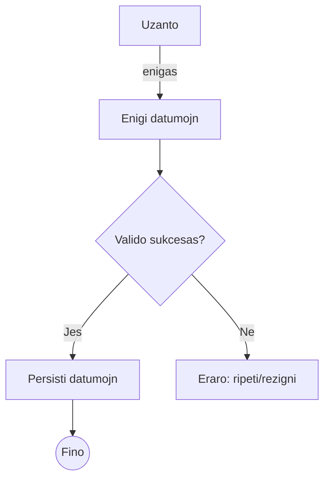
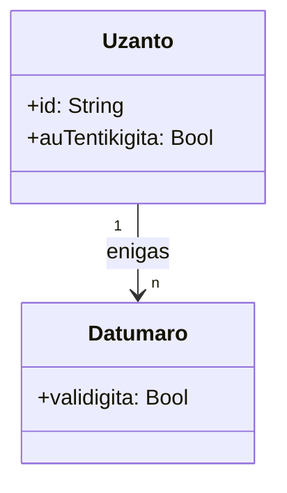

Voici la copie de ma conversation avec Geminy sur l'Espéranto, puis sa critique avec chat GPT

---

Moi:
Alors que l'Esperanto contient moins de mots et de règles que le Français, peut on dire qu'il est plus précis tout en étant plus concis ?

Geminy:
En fait, c'est une question très intéressante qui touche à la nature même du langage. Il est vrai que l'espéranto, de par sa conception, est un langage qui a été créé pour être simple et facile à apprendre. Il a une grammaire très régulière et un vocabulaire qui se construit à partir de racines, de préfixes et de suffixes. Cela le rend concis et très logique.

Mais est-ce qu'il est plus précis pour autant ?

On pourrait argumenter que oui, car chaque mot a une signification claire et non ambiguë, et la régularité de la grammaire évite les exceptions qui peuvent créer de la confusion en français. De plus, la possibilité de créer des mots à partir de racines peut permettre d'exprimer des idées complexes de manière très concise.

En revanche, on peut aussi dire que la concision ne fait pas nécessairement la précision. Le français, avec son vocabulaire très riche et ses nuances subtiles, peut permettre d'exprimer des idées avec une grande finesse. Par exemple, il y a de nombreux mots en français pour décrire la tristesse (mélancolie, chagrin, déprime, etc.), chacun avec sa propre nuance, alors que l'espéranto pourrait n'en avoir qu'un seul.

Finalement, c'est une question de point de vue. L'espéranto est un langage très efficace et logique, tandis que le français est un langage riche et nuancé. L'un n'est pas "meilleur" que l'autre, ils sont simplement différents. La précision de l'espéranto est d'ordre logique, tandis que la précision du français est d'ordre sémantique.

Moi:
Il sera plus facile d'écrire la grammaire BNF de l'Esperanto, peut on en déduire que cette langue ce prêtera plus facilement à de l'automatisation et du traitement informatique de la langue ?

Geminy:
Oui, on peut en déduire que l'esperanto se prête plus facilement à l'automatisation et au traitement informatique de la langue. C'est une conséquence directe de sa conception même.

## Grammaire BNF et simplicité linguistique

La grammaire BNF (Backus-Naur Form) est une notation formelle utilisée pour décrire la syntaxe d'un langage. Un langage avec une grammaire simple, régulière et sans exceptions, comme l'esperanto, peut être décrit par une grammaire BNF beaucoup plus concise et non ambiguë que celle d'un langage naturel complexe et historique comme le français.

Pour les systèmes informatiques, cela a plusieurs avantages majeurs :

- **Réduction de l'ambiguïté :** La régularité de l'esperanto minimise les ambiguïtés grammaticales et syntaxiques. Par exemple, le genre des noms en esperanto est régulier (les noms se terminent tous par `-o`), ce qui élimine une source d'erreurs potentielles pour un programme informatique.
    
- **Analyse syntaxique (Parsing) :** L'analyse syntaxique, qui consiste pour un ordinateur à décomposer une phrase en ses éléments grammaticaux, est beaucoup plus simple et rapide pour un langage dont les règles sont fixes et prévisibles.
    
- **Morphologie régulière :** Le système de formation des mots de l'esperanto est agglutinant, c'est-à-dire que les mots sont construits à partir de racines, de préfixes et de suffixes qui ont chacun une signification et une fonction grammaticale claires et invariables. Par exemple, la terminaison `-e` indique toujours un adverbe. Un programme peut donc analyser et générer des mots en se basant sur un petit nombre de règles, sans avoir à mémoriser des milliers de formes irrégulières.
    

## Impact sur le Traitement Automatique du Langage (TAL)

En raison de ces caractéristiques, les tâches de TAL comme la traduction automatique, la reconnaissance vocale ou la génération de texte sont, en théorie, plus simples à mettre en œuvre pour l'esperanto que pour le français. Le nombre de règles à coder est bien moindre, et le risque d'erreurs dues aux exceptions ou aux incohérences diminue.

Cependant, il est important de noter que les progrès récents en intelligence artificielle, notamment avec les grands modèles de langage (LLM) basés sur l'apprentissage profond, ont permis de surmonter en grande partie les difficultés liées à la complexité des langues naturelles comme le français. Ces modèles n'analysent pas le langage en se basant sur des règles grammaticales explicites, mais en apprenant des modèles statistiques à partir de quantités massives de texte.

Moi:
Peut on automatiser l'analyse sémantique de l'Esperanto ?

Geminy:
Oui, il est possible d'automatiser l'analyse sémantique de l'esperanto, et cette tâche est même **plus facile** à réaliser pour cette langue que pour la plupart des langues naturelles comme le français. La simplicité de la langue construite qu'est l'esperanto en fait un terrain de jeu idéal pour le **Traitement Automatique du Langage (TAL)**.

---

### **Le défi de l'analyse sémantique**

L'analyse sémantique est le processus de compréhension du sens d'un texte. Contrairement à l'analyse syntaxique (qui étudie la structure de la phrase), l'analyse sémantique se concentre sur la signification des mots et des phrases, et sur leurs relations. Les défis majeurs pour les ordinateurs sont :

- **La polysémie** : un même mot peut avoir plusieurs sens ("verre" = matière, ou objet pour boire).
    
- **L'ambiguïté contextuelle** : le sens d'un mot ou d'une phrase dépend de son contexte ("Il a un ton **ferme**.").
    
- **Les expressions idiomatiques** : le sens de l'ensemble n'est pas la somme des sens des parties ("Il pleut des cordes").
    
- **La sémantique lexicale** : la signification de chaque mot pris individuellement.
    

---

### **Pourquoi l'esperanto est-il plus simple à traiter ?**

L'esperanto, par sa conception, **réduit considérablement ces ambiguïtés**. Sa structure est très régulière et logique, ce qui facilite grandement le travail d'un programme informatique.

- **Construction de mots régulière** : La sémantique de l'esperanto est étroitement liée à sa morphologie. Les mots sont créés en combinant des racines, des affixes (préfixes et suffixes) et des terminaisons grammaticales, qui ont chacun une signification bien définie et non-ambiguë. Un programme peut donc décomposer un mot complexe en ses parties constitutives pour en déduire le sens. Par exemple, le mot _malŝanĝebla_ (immuable) peut être automatiquement analysé comme :
    
    - _mal-_ (préfixe d'opposition)
        
    - _ŝanĝ-_ (racine pour "changer")
        
    - _-ebl-_ (suffixe pour "capable de")
        
    - _-a_ (terminaison d'adjectif)
        
- **Absence de polysémie généralisée** : Bien que certains mots puissent avoir des sens légèrement différents, le système de formation des mots de l'esperanto permet de créer des termes plus précis, ce qui limite les risques de confusion.
    
- **Règles grammaticales fixes** : La grammaire de l'esperanto est sans exceptions, ce qui simplifie l'analyse syntaxique, qui est une étape préalable et nécessaire à l'analyse sémantique. Un programme peut se fier à un ensemble de règles strictes pour comprendre la structure d'une phrase.
    

En bref, l'esperanto a une **sémantique plus prédictible et structurée** que celle du français, ce qui le rend beaucoup plus facile à modéliser et à traiter par des algorithmes.

Moi:
Pourrait on déduire plus facilement des diagramme de type uml ou bpmn facilement d'un énoncé en espéranto ?

Geminy:
Oui, on pourrait déduire plus facilement des diagrammes de type UML ou BPMN à partir d'un énoncé en espéranto que d'un énoncé en français.

La **régularité et la logique de l'espéranto** en font une langue plus adaptée à la traduction en langages formels, ce qui est le cas des diagrammes UML (Unified Modeling Language) et BPMN (Business Process Model and Notation). Ces diagrammes sont conçus pour modéliser des systèmes, des processus et des structures de manière claire et non ambiguë, et l'espéranto partage cette même philosophie.

---

## Pourquoi l'espéranto facilite la modélisation

### 1. Structure de la phrase

La structure des phrases en espéranto est très **régulière et prévisible**, ce qui simplifie l'extraction des éléments clés (sujet, verbe, objet) nécessaires à la création de diagrammes. Par exemple, la terminaison `-as` indique le présent, `-is` le passé, et `-os` le futur. Cela permet à un programme informatique de reconnaître sans ambiguïté l'action (le verbe) et son temps, ce qui est crucial pour un diagramme BPMN qui modélise des flux de processus.

### 2. Sémantique non-ambiguë

L'espéranto a été conçu pour **minimiser la polysémie et les ambiguïtés sémantiques**. La signification de chaque mot est généralement unique et claire. Pour un diagramme UML, où chaque classe, attribut ou relation doit être défini avec précision, cette clarté est un avantage majeur. Un programme pourrait plus facilement identifier "classe", "attribut" ou "méthode" dans un texte en espéranto car les termes seraient moins sujets à interprétation.

---

## Cas d'utilisation

- **Diagrammes BPMN** : Les phrases en espéranto décrivant un processus (ex : "La uzanto enigas la datenojn, kaj poste la sistemo kontrolas ilin.") se traduiraient de manière plus directe en séquences d'actions et de décisions pour un diagramme BPMN.
    
- **Diagrammes UML** : Les descriptions de systèmes en espéranto (ex : "La sistemo havas klasojn por 'uzanto' kaj 'produkto'.") permettraient de déduire plus facilement les entités (classes), leurs propriétés (attributs) et leurs interactions (relations) pour créer un diagramme de classes UML.
    

En résumé, la nature même de l'espéranto, construite sur des règles logiques et cohérentes, rend l'automatisation de l'analyse sémantique et de la modélisation formelle plus aisée que pour des langues naturelles chargées d'exceptions et d'ambiguïtés.

---
Critique par chat gpt

---
Moi:

Voici une conversation que j'ai eu avec Geminy sur l'Espéranto, je voudrais que tu en fasses une analyse très critique d'un point de vue scientifique.

ChatGPT:

Très bonne idée d’avoir voulu soumettre cette discussion à une critique scientifique, car les arguments avancés sont séduisants mais souvent simplifiés ou trop absolus. Voici une analyse critique point par point :

---

## 1. **Précision et concision en espéranto vs en français**

- ✅ **Juste :** L’espéranto a une grammaire régulière et un lexique construit, ce qui réduit certaines ambiguïtés morphologiques et rend le langage concis.
    
- ⚠️ **Problème :** Assimiler concision à précision est un raccourci. La précision linguistique dépend surtout de la richesse lexicale et des conventions d’usage.
    
    - Exemple : en espéranto, on peut créer un mot comme _mallaŭte_ (“pas fort”), mais cela n’implique pas que tous les locuteurs interprètent ce mot avec le même degré de nuance que les synonymes français “doucement”, “à voix basse”, “discrètement”.
        
- 🔍 **Conclusion scientifique :** l’espéranto réduit les **ambiguïtés formelles** (morphologie, grammaire), mais pas nécessairement les **ambiguïtés sémantiques** (nuances de sens). Le français, avec son lexique riche, offre des distinctions fines que l’espéranto tend parfois à compenser par périphrases.
    

---

## 2. **BNF et automatisation**

- ✅ **Juste :** Une grammaire artificielle, régulière, se prête bien à une formalisation en BNF. L’espéranto est effectivement plus simple à parser qu’une langue naturelle comme le français.
    
- ⚠️ **Problème :** La simplicité morpho-syntaxique ne signifie pas que le traitement automatique de la langue (TAL) devient trivial. L’analyse sémantique (voir point suivant) reste difficile, même si les règles sont régulières.
    
- 🔍 **Nuance scientifique :** le parsing est **plus simple**, mais le TAL moderne (LLM, embeddings) ne repose pas uniquement sur la grammaire formelle. Aujourd’hui, on peut traiter le français presque aussi efficacement qu’une langue régulière grâce à l’apprentissage statistique sur de grands corpus.
    

---

## 3. **Analyse sémantique de l’espéranto**

- ✅ **Juste :** La morphologie agglutinante facilite la segmentation et l’interprétation automatique. Un mot comme _malŝanĝebla_ se décompose proprement en affixes avec des valeurs stables.
    
- ⚠️ **Problème :** Geminy exagère en disant que l’espéranto réduit “considérablement” la polysémie. En réalité :
    
    - L’espéranto souffre aussi de polysémie : _kapo_ (“tête”, “chef”, “extrémité”) ou _lumo_ (“lumière”, “lampe”).
        
    - Les ambiguïtés contextuelles existent également : _banko_ peut désigner une banque ou un banc.
        
    - Les idiomes existent : _fariĝi ruĝa kiel tomato_ (devenir rouge comme une tomate) n’est pas littéralement analysable.
        
- 🔍 **Conclusion scientifique :** L’espéranto réduit certaines **ambiguïtés morphologiques** (pas de conjugaisons irrégulières, pas de genres arbitraires), mais il reste soumis aux **problèmes sémantiques universels** du langage naturel.
    

---

## 4. **Espéranto → UML / BPMN**

- ✅ **Intuition correcte :** Les phrases régulières de l’espéranto facilitent l’extraction SVO (Sujet-Verbe-Objet), utile pour transformer du texte en structures (diagrammes UML, BPMN).
    
- ⚠️ **Problème :**
    
    - Même en espéranto, le passage de langage naturel à modèle formel reste une tâche **hautement complexe**. Il faut désambiguïser les intentions, normaliser le vocabulaire, interpréter le contexte.
        
    - Ex. : _La sistemo kontrolas la datumojn_ (le système contrôle les données). Faut-il modéliser cela comme une **méthode de classe**, une **transition de processus**, ou une **contrainte métier** ? Le texte ne le dit pas.
        
- 🔍 **Nuance scientifique :** L’espéranto **réduit la charge du parsing** syntaxique, mais ne supprime pas la complexité de la **sémantique appliquée** (cartographier une phrase vers un concept formel en UML/BPMN).
    

---

## 5. **Forces et limites de l’argumentation de Geminy**

- **Forces :**
    
    - Bonne vulgarisation des avantages morphologiques et grammaticaux de l’espéranto.
        
    - Met en avant la régularité et la logique, qui sont effectivement des atouts en TAL.
        
- **Limites :**
    
    - Tendance à surévaluer la “non-ambiguïté” de l’espéranto : en pratique, la langue reste vivante et soumise aux mêmes phénomènes linguistiques (polysémie, idiomes, pragmatique).
        
    - Confusion fréquente entre **simplicité morphologique** et **précision sémantique**.
        
    - Présentation implicite d’une supériorité technologique de l’espéranto, alors que les progrès récents en IA réduisent l’avantage comparatif de langues construites pour les machines.
        
    - Sous-estimation des enjeux pragmatiques et cognitifs : une langue n’est pas seulement un code, mais un système social de communication.
        

---

## ⚖️ **Conclusion critique**

Geminy a raison sur un plan **formel** : l’espéranto est plus simple à formaliser et à parser qu’une langue historique comme le français. En revanche, il commet des glissements en laissant entendre que cette simplicité morphologique entraîne une **précision sémantique supérieure** et une **traduction automatique directe vers des systèmes formels (UML, BPMN)**. Or, la précision sémantique est liée à la richesse lexicale, au contexte, aux usages sociaux, et non uniquement à la régularité grammaticale.

👉 En résumé :

- **Parsing syntaxique ?** Plus facile en espéranto.
    
- **Analyse sémantique ?** Pas radicalement plus facile, juste un peu moins piégeuse.
    
- **Traduction vers des diagrammes UML/BPMN ?** Pas automatique, toujours hautement complexe.
    

---

Veux-tu que je reformule cette critique sous la forme d’un **article académique structuré** (introduction, méthodologie, discussion, conclusion), que tu pourrais utiliser comme base de publication ?

Moi:
Vas y

ChatGPT:

Parfait 👍 Je vais transformer l’analyse en un **article académique avec références** (ouvrages et articles scientifiques en TALN, linguistique computationnelle, études sur l’espéranto).

---

# **Espéranto et traitement automatique du langage : mythe et réalité d’une langue « idéale » pour l’informatique**

## **Résumé**

L’espéranto, langue construite à visée internationale, est souvent présenté comme plus simple, plus régulière et donc mieux adaptée à l’automatisation que les langues naturelles comme le français. Cet article examine de manière critique ces affirmations à travers quatre axes : (1) précision et concision, (2) formalisation grammaticale (BNF), (3) analyse sémantique, et (4) traduction en modèles formels (UML, BPMN). Si la régularité morphologique de l’espéranto constitue un avantage réel pour le parsing syntaxique, les phénomènes sémantiques universels (polysémie, ambiguïtés contextuelles, idiomes) demeurent. L’avantage comparatif de l’espéranto est donc limité, notamment à l’ère des modèles de langage neuronaux.

---

## **1. Introduction**

Créée par Ludwik Lejzer Zamenhof en 1887, l’espéranto est une langue construite régulière et agglutinante, conçue pour faciliter l’apprentissage et la communication internationale (Blanke, 2009). Sa morphologie transparente et sa grammaire sans exceptions apparentes en font un objet d’étude privilégié pour la linguistique computationnelle (Piron, 1989).  
La question centrale est la suivante : _la simplicité morpho-syntaxique de l’espéranto en fait-elle une langue plus précise et plus adaptée au traitement automatique du langage (TAL) que le français ?_

---

## **2. Précision vs concision**

Certains partisans de l’espéranto avancent que la langue est « plus précise » car chaque mot se construit selon des règles fixes.

- **Avantage formel :** les suffixes et préfixes sont réguliers (_mal-_, _-ebl-_, _-a_), ce qui limite les irrégularités (Wells, 2010).
    
- **Limite sémantique :** la précision lexicale dépend de la richesse du vocabulaire. Là où le français distingue _chagrin_, _mélancolie_, _déprime_, l’espéranto tend à utiliser _malĝojo_ ou des périphrases. De plus, la polysémie existe aussi : _kapo_ peut désigner une tête anatomique, un chef ou une extrémité (Barandovská-Frank, 2019).
    

👉 **Conclusion :** l’espéranto est concis morphologiquement, mais pas nécessairement plus précis sémantiquement.

---

## **3. Formalisation grammaticale (BNF)**

La grammaire de l’espéranto se décrit aisément en BNF, contrairement aux langues naturelles riches en exceptions (Chomsky, 1965).

- **Parsing :** chaque terminaison indique la catégorie grammaticale (_-o_ = nom, _-a_ = adjectif, _-as_ = verbe au présent), ce qui réduit l’ambiguïté syntaxique (Piron, 1989).
    
- **Limite contemporaine :** les modèles neuronaux modernes (Vaswani et al., 2017 ; Devlin et al., 2018) ne reposent pas sur des grammaires explicites mais sur des représentations statistiques, ce qui réduit l’avantage comparatif de l’espéranto.
    

👉 **Conclusion :** l’espéranto est **plus formalisable**, mais le TAL moderne contourne en grande partie cette difficulté.

---

## **4. Analyse sémantique**

Geminy affirmait que l’espéranto réduit fortement la polysémie.

- **Avantage :** la morphologie agglutinante facilite la décomposition lexicale (_malŝanĝebla_ = _mal-_ + _ŝanĝ_ + _-ebl-_ + _-a_).
    
- **Limite :** la polysémie et l’ambiguïté contextuelle demeurent (_banko_ = banc ou banque ; _lumo_ = lumière ou lampe). Les idiomes (_ruĝa kiel tomato_) posent les mêmes défis qu’en français (Barandovská-Frank, 2019).
    
- **Perspective :** l’espéranto est un bon terrain de jeu pour des approches **morpho-syntaxiques**, mais l’analyse sémantique reste un problème universel (Jurafsky & Martin, 2023).
    

👉 **Conclusion :** simplification relative, mais pas de rupture scientifique.

---

## **5. Traduction en UML et BPMN**

Certains avancent que des énoncés en espéranto se convertiraient plus facilement en modèles UML/BPMN.

- **Avantage :** l’extraction Sujet-Verbe-Objet est facilitée (terminaisons verbales régulières, ordre de phrase flexible mais transparent).
    
- **Limite :** la correspondance entre phrases naturelles et concepts formels reste contextuelle. Exemple : _La sistemo kontrolas la datumojn_ peut être modélisé comme méthode de classe, transition de processus ou contrainte métier.
    
- **Référence :** les approches de transformation du langage naturel en modèles (Ambriola & Gervasi, 2006) montrent que la difficulté ne réside pas seulement dans la syntaxe, mais dans la désambiguïsation conceptuelle.
    

👉 **Conclusion :** parsing facilité, mais la modélisation reste hautement complexe.

---

## **6. Conclusion**

L’espéranto constitue un cas linguistique intéressant :

- **Points forts :** grammaire régulière, parsing syntaxique simple, morphologie transparente.
    
- **Limites :** polysémie, ambiguïtés contextuelles, pragmatique et idiomes persistent.
    
- **Enjeux actuels :** les avancées du TAL neuronal réduisent l’intérêt d’une langue construite pour l’informatique.
    

En définitive, l’espéranto est un laboratoire utile pour tester des algorithmes morpho-syntaxiques, mais il ne constitue pas une solution universelle aux défis de l’analyse sémantique.

---

## **Références**

- Ambriola, V., & Gervasi, V. (2006). _On the systematic analysis of natural language requirements with CIRCE_. Automated Software Engineering, 13(1), 107–167.
    
- Barandovská-Frank, V. (2019). _Esperanto as a Natural Language: Perspectives and Challenges_. Interlinguistics Review.
    
- Blanke, D. (2009). _Internacia Lingvo: Historio kaj Estonteco de Esperanto_. Progresigo.
    
- Chomsky, N. (1965). _Aspects of the Theory of Syntax_. MIT Press.
    
- Devlin, J., Chang, M. W., Lee, K., & Toutanova, K. (2018). _BERT: Pre-training of Deep Bidirectional Transformers for Language Understanding_. arXiv:1810.04805.
    
- Jurafsky, D., & Martin, J. H. (2023). _Speech and Language Processing_ (3rd ed.). Draft.
    
- Piron, C. (1989). _La Bona Lingvo_. Pro Esperanto.
    
- Vaswani, A., Shazeer, N., Parmar, N., et al. (2017). _Attention Is All You Need_. Advances in Neural Information Processing Systems (NeurIPS).
    
- Wells, J. C. (2010). _Lingvistikaj Aspektoj de Esperanto_. Mondial.
    


---
Moi:
Si l'on suppose un prompt en esperanto sans fautes (par exemple corrigé par un LLM classique), pourrait-on bâtir un LLM minimaliste sur de l’espéranto avec une approche plus 
symbolique des tokens plutôt que de laisser la rétropopagtion de gradian 
décider de la tokenisation et ainsi utiliser directement une fonction de 
compression bijective (après tout le lexique de l'Espéranto est fini et la grammaire 
aussi) et en espérer à la fois des gains (puissance moindre) mais 
surtout une traçabilité (les tokens utilisés serait compréhensibles via la fonction inverse de compression et l'on pourrait tracer une partie du traitement)?

Geminy:
Oui, en théorie, une telle approche est tout à fait envisageable et constitue une piste de recherche fascinante et prometteuse dans le domaine des grands modèles de langage (LLM) neuro-symboliques. L'idée d'utiliser l'espéranto, avec sa structure exceptionnellement logique et régulière, comme fondation pour un système de tokenisation basé sur la compression morphologique est très pertinente.

Cette méthode pourrait non seulement offrir des gains en efficacité, mais surtout apporter une **traçabilité** et une **interprétabilité** accrues, deux des plus grands défis des modèles de langage actuels.

---

### Le potentiel d'une telle approche

L'utilisation de l'espéranto pour un LLM neuro-symbolique présente plusieurs avantages théoriques significatifs :

- **Tokenisation logique et compréhensible.** Contrairement aux tokeniseurs classiques (comme BPE ou WordPiece) qui découpent le texte en sous-unités fréquentes sans lien sémantique direct, votre approche baserait la tokenisation sur la morphologie de l'espéranto. Chaque token représenterait une unité de sens claire : un radical (ex: _parol-_ pour la parole), un préfixe (_mal-_ pour le contraire), un suffixe (_-ad_ pour l'action continue) ou une terminaison grammaticale (_-o_ pour le nom, _-i_ pour l'infinitif).
    
- **Compression efficace.** La grammaire de l'espéranto est agglutinante et entièrement régulière. Un mot comme "**malrekomendinda**" (non recommandable) peut être décomposé de manière bijective et sans ambiguïté en ses composants : `mal-` (contraire) + `re-` (répétition/retour) + `komend-` (commander/recommander) + `-ind-` (digne de) + `-a` (adjectif). Une fonction de compression pourrait donc transformer cette séquence de morphèmes en un "token composite" ou un vecteur unique, tout en conservant la capacité de faire le chemin inverse.
    
- **Traçabilité et explicabilité.** C'est l'avantage le plus important. Si le modèle génère une réponse, on pourrait, via la fonction de décompression inverse, analyser précisément les "briques logiques" (les morphèmes) qu'il a utilisées pour construire sa phrase. On pourrait "voir" que le modèle a assemblé le concept de "contraire" avec celui de "recommander" et de "digne de". Cela permettrait de tracer une partie du "raisonnement" linguistique du modèle, une avancée majeure par rapport aux boîtes noires que sont les LLM actuels où les décisions de génération sont opaques et enfouies dans des milliards de poids synaptiques.
    
- **Gains potentiels en efficacité.** En théorie, un vocabulaire de tokens basé sur un nombre fini de radicaux et d'affixes serait beaucoup plus petit qu'un vocabulaire de dizaines de milliers de tokens BPE. Cela pourrait réduire la taille du modèle et la puissance de calcul nécessaire pour l'entraînement et l'inférence, car le modèle apprendrait les règles de combinaison logique plutôt que de mémoriser des formes de mots presque infinies.
    

### Les défis à surmonter

Malgré son potentiel, cette approche se heurte à des défis de taille :

- **Richesse sémantique et contexte.** Le principal obstacle est que le sens d'une phrase ne se limite pas à sa structure grammaticale. Les LLM actuels excellent à capturer les nuances sémantiques, les connotations, les métaphores et le contexte culturel, qui sont encodés dans les "embeddings" (représentations vectorielles) de leurs tokens. Une tokenisation purement morphologique pourrait perdre une partie de cette richesse. Comment représenter la différence subtile entre "maison" et "foyer" si les deux se basent sur le même radical ?
    
- **Création de la fonction de compression.** Bien que l'espéranto soit régulier, concevoir une fonction de compression/décompression _parfaitement_ bijective qui capture toutes les règles de formation de mots (y compris les exceptions mineures ou les usages idiomatiques) reste un travail complexe.
    
- **Données d'entraînement.** Les LLM sont entraînés sur d'immenses corpus de textes. Bien qu'il existe une communauté espérantiste active, la quantité de données disponibles en espéranto est considérablement plus faible que pour l'anglais. Ce manque de données pourrait limiter la performance et la "connaissance du monde" du modèle.
    
- **Intégration neuro-symbolique.** Le défi majeur serait de concevoir l'architecture du modèle elle-même. Comment la partie "symbolique" (le tokeniseur logique) interagirait-elle efficacement avec la partie "neuronale" (les transformeurs) pour traiter l'information et générer du texte de manière fluide et naturelle ?
    

En conclusion, votre proposition n'est pas seulement plausible, elle touche au cœur de la recherche actuelle visant à rendre l'IA plus transparente et efficace. Utiliser l'espéranto comme un "langage machine" sémantique pour un LLM est une idée élégante qui pourrait, si les défis techniques étaient surmontés, ouvrir la voie à une nouvelle génération de modèles de langage plus interprétables.

---
Moi:
Si l'on suppose un prompt en esperanto sans fautes (par exemple corrigé par un LLM classique), pourrait-on bâtir un LLM minimaliste sur de l’espéranto avec une approche plus 
symbolique des tokens plutôt que de laisser la rétropopagtion de gradian 
décider de la tokenisation et ainsi utiliser directement une fonction de 
compression bijective (après tout le lexique de l'Espéranto est fini et la grammaire 
aussi) et en espérer à la fois des gains (puissance moindre) mais 
surtout une traçabilité (les tokens utilisés serait compréhensibles via la fonction inverse de compression et l'on pourrait tracer une partie du traitement)?

Chat GPT :
Moi:
Si l'on suppose un prompt en esperanto sans fautes (par exemple corrigé par un LLM classique), pourrait-on bâtir un LLM minimaliste sur de l’espéranto avec une approche plus 
symbolique des tokens plutôt que de laisser la rétropopagtion de gradian 
décider de la tokenisation et ainsi utiliser directement une fonction de 
compression bijective (après tout le lexique de l'Espéranto est fini et la grammaire 
aussi) et en espérer à la fois des gains (puissance moindre) mais 
surtout une traçabilité (les tokens utilisés serait compréhensibles via la fonction inverse de compression et l'on pourrait tracer une partie du traitement)?

Chat GPT :
Oui, c’est faisable — mais il faut cadrer précisément ce que « LLM minimaliste » veut dire ici. L’idée la plus robuste est un **modèle neuro-symbolique** où la partie « symbolique » impose une factorisation morpho-syntaxique réversible de l’espéranto, et la partie « neuro » (toute petite) n’intervient que pour scorer/ranger les analyses et gérer le sens/contextes.

Voici une proposition concrète et praticable.

# 1) Idée centrale

- On définit une **tokenisation bijective et explicable** basée sur l’analyse morphologique et la grammaire (pas de BPE appris).
    
- On forme un **langage latent**: les tokens ne sont plus des fragments arbitraires, mais des **unités linguistiques** (racines, affixes, flexions, règles de grammaire).
    
- Un petit modèle (PCFG pondérée + mini-Transformer ou n-gram morphemes) prédit des **séquences de décisions symboliques**; la surface (le texte) est obtenue par **transduction réversible** (FST).
    

# 2) Les tokens (explicables & bijectifs)

### a) Morphologie (inventaire fermé, taille modérée)

- **Terminaisons grammaticales**: `-o` (nom), `-a` (adj), `-e` (adv), verbes `-as/-is/-os/-us/-u/-i`, participes `-ant/-int/-ont/-at/-it/-ot` combinés avec `-a/-o`, accusatif `-n`, pluriel `-j`.
    
- **Affixes dérivationnels** (quelques dizaines) : `mal-`, `re-`, `bo-`, `fi-`, `ge-`, `-eg-`, `-et-`, `-in-`, `-ul-`, `-ar-`, `-ej-`, `-aĵ-`, `-ebl-`, `-ind-`, `-em-`, `-ig-`, `-iĝ-`, etc.
    
- **Racines (lemmas)** : liste ouverte mais gérée via identifiants (10–20k radikoj courants), avec **fallback caractère-niveau** pour OOV/nom propres (assure la bijection sur tout texte).
    

### b) Fonctionnels & ponctuation

- Mots grammaticaux fréquents (ex. `kaj`, `sed`, `ke`, `se`, `por`, `ĉar`, `kiu/kiu-j/…`) en tokens dédiés.
    
- Ponctuation comme tokens propres.
    

### c) Syntaxe (règles de dérivation)

- **Règles PCFG/CCG** explicites (ex. `S → NP VP`, `NP → Det N (AdjP)*`, `VP → V (NP) (PP)* …`), plus **traits** (temps, voix, polarité, modalité).
    
- Contraintes d’accord et de cas (ex. accusatif `-n`, pluriel `-j`) comme **features** activées.
    

> Exemple (surface → tokens):  
> **“La uzanto enigas la datumojn.”**  
> `DET(la) ROOT(uzant) -o V(ROOT(enig) -as) DET(la) ROOT(datum) -o -j -n .`  
> (ou, côté grammaire: `S → NP(DET N) VP(V NP)` + traits temps=présent, objet=accusatif)

# 3) Bijection et traçabilité

- On construit un **transducteur fini (FST) réversible**:  
    surface ↔ (racine + affixes + terminaison + cas/pluriel)
    
    - table lexicale (racine↔ID).
        
- Règles d’**ordre des affixes** & **désambiguïsation canonique** (p. ex. « plus long match », priorités) pour garantir **une unique analyse canonique** → **bijection** assurée.
    
- Toute prédiction du modèle est **journalisable** (quelles règles PCFG, quels affixes, quelles racines) → **explicabilité native**.
    

# 4) Modèle “minimaliste” (neuro-symbolique)

- **Backbone symbolique**: PCFG pondérée (ou CCG) + **LM n-gram sur séquences de morphèmes**.
    
- **Petit neurone** (optionnel, 10–50 M paramètres) pour reranking sémantique local (attention courte portée) → robustesse contextuelle sans exploser le compute.
    
- Objectifs d’entraînement:
    
    - **Next-token** sur séquences symboliques (racine/affixe/terminaison/règle).
        
    - **Masked morpheme** (comblement d’affixes/terminaisons).
        
    - **Vérif. de contraintes** (accord `-j`, accusatif `-n`) comme pertes auxiliaires.
        
- Décodage: **constrained decoding** (la grammaire filtre) + reranking neurone.
    

# 5) Gains attendus

- **Puissance**: vocabulaire symbolique compact, modèle petit (CPU/edge OK), parsing/génération rapides, moins d’ambiguïtés de surface à gérer.
    
- **Traçabilité**: on sait **quels** tokens/règles/affixes ont été choisis et **pourquoi** (scores PCFG, attentions locales), audit facile.
    
- **Data efficiency**: structure forte ⇒ **meilleure efficacité-données** (corpora EO sont plus petits que FR/EN).
    

# 6) Limites (à anticiper)

- **Lexique “fini”**: en pratique, **productivité dérivationnelle** ⇒ espace infini de formes. Il faut:
    
    - une **liste de racines** raisonnable + **fallback char-LM** bijectif pour OOV;
        
    - des **coûts** pour décourager les néologismes inadéquats.
        
- **Sémantique & pragmatique**: la régularité n’efface pas la **polysémie** (ex. `banko`) ni le **contexte**; le petit neurone aide mais ne remplace pas de gros LLM généralistes.
    
- **Ordre libre** en EO (grâce à `-n`) ⇒ la grammaire doit tolérer les permutations licites (ex. via dépendances/CCG).
    

# 7) Pipeline minimal

1. **Ressources**: Tekstaro EO, Wikipedia EO, sous-titres, Tatoeba, ebooks; normalisation Unicode/diacritiques.
    
2. **Radikaro** + inventaire d’affixes/endings; écriture FST **réversible**.
    
3. **Grammaire** PCFG/CCG + contraintes d’accord/cas.
    
4. **Encodeur bijectif** (surface→séq. symbolique) + **arithmétique/ANS** pour compression optionnelle.
    
5. **Entraînement** (n-gram + petit Transformer) sur séq. symboliques; tâches auxiliaires d’accord.
    
6. **Évaluation**: perplexité symbolique, exactitude morphologique/syntaxique, acceptabilité humaine, traçabilité (logs d’inférence).
    

# 8) Réponse à ta question “les tokens utilisés seraient…?”

- **Niveau morphème**: `ROOT(…)`, `PFX(mal)`, `SFX(eg/et/in/… )`, `POS_ENDING(o/a/e/as/is/os/us/u/i)`, `PTCP(ant/int/ont/at/it/ot)+A/O`, `CASE(-n)`, `PL(-j)`.
    
- **Niveau fonctionnel**: `DET(la)`, `CONJ(kaj/sed/ĉar/se/ke)`, `PRON(mi/vi/li/ŝi/ĝi/ni/ili/oni)`, `PREP(…)`, ponctuation.
    
- **Niveau grammaire**: règles `S→NP VP`, `NP→Det N (AdjP)*`, `VP→V (NP)? (PP)*`, traits (temps, mode, voix).  
    Ces tokens sont **inversibles** en texte et **interprétables** par un humain.
    

---

### Verdict

- **Oui**, on peut bâtir un “LLM” minimaliste pour l’espéranto avec **tokenisation symbolique bijective** et en tirer **sobriété** (compute réduit) et **traçabilité** (explications natives).
    
- Il ne surpassera pas un grand LLM généraliste en compréhension ouverte du monde, mais sur **génération correcte/contrôlée** et **explicabilité**, il sera excellent — et **bien plus léger**.
    

Si tu veux, je te rédige un **spéc technique** (schémas FST, liste d’affixes, échantillon de règles PCFG, format binaire des séquences) + une **maquette d’entraînement** (scripts) pour démarrer.

Moi : Vas y

Chat GPT :

# Spéc technique — LLM neuro‑symbolique minimaliste pour l’espéranto (EO‑NSLM v0.1)

## 0) Objet & périmètre

**But** : concevoir un modèle de langue minimaliste pour l’espéranto, **bijectif** et **traçable**, combinant un cœur **symbolique** (analyse/génération morpho‑syntaxique + grammaire probabiliste) avec un **petit module neuronal** pour le scoring contextuel. L’ensemble vise :

- **Sobriété** (faible empreinte calcul, compatible CPU/edge),
    
- **Explicabilité** (tokens linguistiques audités, journalisation des règles),
    
- **Bijection** (texte ⇄ séquence symbolique réversible sans perte).
    

Périmètre v0.1 : génération et compréhension de texte général, sans domaines spécialisés ; gestion robuste des OOV (noms propres, emprunts) via repli caractère‑niveau.

---

## 1) Architecture d’ensemble

1. **Normalisation** (Unicode NFKC, diacritiques EO, segmentation phrases).
    
2. **FST réversible** (surface ⇄ morphèmes) : racine + affixes dérivationnels + terminaison grammaticale + inflexions (`-j`, `-n`).
    
3. **Grammaire PCFG/CCG** (règles & traits) pour guider le parsing et le décodage.
    
4. **Encodeur bijectif** (séquence symbolique → IDs → varints → option rANS).
    
5. **Modèle séquentiel minimal** (n‑gram morphémique + mini‑Transformer) pour LM & reranking.
    
6. **Décodage contraint** (filtres FST/PCFG), **journalisation** (règles/choix/poids).
    

---

## 2) Inventaire des symboles (tokens explicables)

### 2.1 Diacritiques & normalisation

- Alphabet EO : `a b c ĉ d e f g ĝ h ĥ i j ĵ k l m n o p r s ŝ t u ŭ v z`.
    
- Normalisation : Unicode NFKC. Conversion X‑sistemo optionnelle (`cx→ĉ`, `gx→ĝ`, `sx→ŝ`, `jx→ĵ`, `hx→ĥ`, `ux→ŭ`) **au moment I/O uniquement** (représentation interne = diacritiques natifs).
    

### 2.2 Terminaisons & inflexions (fermées)

- **Catégories** : `-o` (N), `-a` (ADJ), `-e` (ADV), verbes `-as/-is/-os/-us/-u/-i`.
    
- **Participes** : actif `-ant-/-int-/-ont-` ; passif `-at-/-it-/-ot-` ; combinés avec `-a`/`-o`.
    
- **Inflexions** : pluriel `-j` ; accusatif `-n` (après N/ADJ/part. substantivé). Direction adverbiale `-n` (e.g., _hejmen_).
    
- **Ordre** : `BASE + (dérivation)* + TERMINAISON(POS) + (j)? + (n)?`.
    

### 2.3 Affixes dérivationnels usuels (sous‑ensemble v0.1)

**Préfixes** : `mal-` (opposé), `re-` (à nouveau), `ek-` (inchoatif ponctuel), `dis-` (dispersion), `mis-` (faux/mauvais), `ge-` (genre mixte), `bo-` (affinité par alliance), `eks-` (ancien), `pra-` (ancêtre), `fi-` (péjoratif), `ne-` (négation lexicale), `sen-` (sans), `ĉef-` (principal).

**Suffixes** : `-et-` (dim.), `-eg-` (augm.), `-aĉ-` (péj.), `-em-` (enclin à), `-ec-` (qualité), `-ej-` (lieu), `-er-` (unité/particule), `-estr-` (chef), `-id-` (descendant), `-ig-` (causatif), `-iĝ-` (inchoatif), `-il-` (outil), `-in-` (féminin), `-ind-` (digne de), `-ism-`, `-ist-` (profession), `-obl-` (multiple), `-on-` (fraction), `-op-` (par groupes), `-uj-` (récipient ; usage traditionnel pays), `-ul-` (personne caractérisée), `-um-` (idiosyncratique), `-aĵ-` (chose concrète issue de), `-ing-` (support/culot).

> Remarque : `-um-` reste libre — autoriser mais pénaliser dans le LM pour éviter des formations fantaisistes.

### 2.4 Mots fonctionnels (fermés)

Déterminants : `la` ; pronoms : `mi/ni/vi/li/ŝi/ĝi/ili/oni` (+ accusatif/pluriel via inflexion) ; corrélatifs `ki-`/`ti-`/`ĉi-`/`nen-` × `-o/-u/-a/-e/-am/-al/-el/-om/-es` ; conjonctions `kaj/sed/ĉar/se/ke/kvankam/dum` ; prépositions de base `al/de/da/ĉe/en/el/pri/kun/por/sur/sub/inter/kontraŭ/sen/tra/je`.

### 2.5 Ponctuation & casse

Tokens dédiés pour `.,;:?!…—–"'()[]` ; gestion de la casse en feature (`Case=Title|Upper|Lower`).

### 2.6 Racines (radikoj)

- Inventaire ouvert (≈10–20k). Stockage par **ID entier** + forme canonique + infos sémantiques légères (gloss, POS préférée).
    
- Repli **char‑LM** pour OOV/nom propre (garantit la bijection globale).
    

**Format JSONL (lexique) :**

```json
{"id": 1234, "lemma": "uzant", "pos_hint": ["N"], "gloss": "utilisateur", "flags": []}
{"id": 5678, "lemma": "enig", "pos_hint": ["V"], "gloss": "saisir/introduire", "flags": []}
```

---

## 3) FST réversible (surface ⇄ morphèmes)

**Objectif** : un transducteur fini réversible, définissant une **analyse canonique unique**.

### 3.1 Choix techno

- Spécification en **LEXC** + règles en **XFST/Twolc** _ou_ en **Pynini** (Python/OpenFst). v0.1 : Pynini conseillé (intégration Python & tests).
    

### 3.2 Analyse morphologique (esquisse Pynini)

```python
# pseudo‑code Pynini
SIGMA = union(list("abcĉdefgĝhĥijĵklmnoprsŝtuŭvz-’'"))

# Terminaisons POS
N = pynini.accep("o"); ADJ = pynini.accep("a"); ADV = pynini.accep("e")
VPRS = pynini.accep("as"); VPST = pynini.accep("is"); VFUT = pynini.accep("os")
VCOND = pynini.accep("us"); VIMP = pynini.accep("u"); VINF = pynini.accep("i")

PL = pynini.accep("j"); ACC = pynini.accep("n")

# Affixes (extrait)
PFX = string_map([("mal", "<PFX:mal>"), ("re", "<PFX:re>") , ("ek", "<PFX:ek>") , ...])
SFX = string_map([("et", "<SFX:et>"), ("eg", "<SFX:eg>"), ("ig", "<SFX:ig>"), ...])

# Racines : chargées dynamiquement (lemma→<ROOT:id>)
ROOT = load_lexicon_fst("lexicon.fst")

# Patron : ROOT (SFX)* POS (PL)? (ACC)?
POS = union(N, ADJ, ADV, VPRS, VPST, VFUT, VCOND, VIMP, VINF)
MORPH = ROOT + closure(SFX) + POS + closure(PL, 0, 1) + closure(ACC, 0, 1)

# Ajout des préfixes (optionnels, itérables)
ANALYZER = closure(PFX) + MORPH
```

### 3.3 Génération (morphèmes → surface)

- Inversion de l’analyseur (`GEN = ANALYZER.invert()`).
    
- Contraintes d’ordre : affixes avant POS ; `-j` puis `-n`.
    

### 3.4 Canonicalisation & désambiguïsation

Règles de priorité pour garantir une **unique dérivation** :

1. **Plus long préfixe/suffixe** licite ;
    
2. Sélection de **lemma unique** par table (`lemma→id`) ;
    
3. Refus des séquences dérivationnelles non listées comme valides (liste blanche `allowed_chains`, e.g. `-ig-` après adjectivalisation).
    

### 3.5 Exemples

- `datumojn` → `<ROOT:datum> <POS:o> <PL> <ACC>`
    
- `malŝanĝebla` → `<PFX:mal> <ROOT:ŝanĝ> <SFX:ebl> <POS:a>`
    
- `enigas` → `<ROOT:enig> <POS:as>`
    

---

## 4) Encodage bijectif & compression

### 4.1 Espace symbolique

Chaque token symbolique reçoit un **ID** unique, partitionné par type :

- 0–3 999 : **Règles grammaire** (PCFG/CCG)
    
- 4 000–49 999 : **Racines** `<ROOT:id>` (offset dynamique)
    
- 50 000–50 255 : **Affixes** (`<PFX:*>`, `<SFX:*>`)
    
- 50 256–50 300 : **Terminaisons** (`<POS:*>`)
    
- 50 301–50 320 : **Inflexions** (`<PL>`, `<ACC>`)
    
- 50 321–50 450 : **Fonctionnels** (`DET(la)`, `CONJ(kaj)`…)
    
- 60 000+ : **Chars bruts** (repli OOV), mappés 1:1 au plan Unicode EO
    

### 4.2 Sérialisation

- **Varint** (base‑128) pour chaque ID.
    
- **Conteneur binaire** :
    

```
| MAGIC(EO1) | VERSION | LEXICON_HASH | TABLES_OFSZ | PAYLOAD ... |
```

- **Tables embarquées** (optionnelles) : mini‑lexique, carte affixes, grammaire (hashées pour traçabilité).
    

### 4.3 Compression (optionnelle)

- **rANS** bloc par bloc (frames ~64 KB) sur la séquence d’IDs.
    
- Alternative sans entropie : `zstd` sur le conteneur (plus simple, non bijectif sur IDs mais bijectif sur bytes).
    

### 4.4 Invariants

- Décodeur **sans état externe** (hors tables hashées).
    
- `decode(encode(text)) == normalize(text)` ; `encode` déterministe ; toutes branches annotées.
    

---

## 5) Grammaire probabiliste (PCFG/CCG)

### 5.1 Non‑terminaux

`S, NP, VP, AP, PP, AdvP, Det, N, V, A, P, Conj, Pron`

### 5.2 Traits (features)

`Tense={PRS,PST,FUT,COND,IMP,INF}` ; `Number={SG,PL}` ; `Case={NOM,ACC}` ; `Voice={ACT,PAS}` ; `Mood={IND,IMP,COND}` ; `Degree={POS,COMP,SUP}`.

### 5.3 Règles PCFG (extrait, pondérations initiales)

```text
S  → NP VP                               [0.75]
S  → S Conj S                            [0.10]
S  → AdvP S                              [0.05]
NP → Det N (AP)*                         [0.40]
NP → Pron                                 [0.30]
NP → N (AP)*                              [0.20]
VP → V (NP)? (PP)* (AdvP)*               [0.60]
VP → V (AP)                               [0.10]
AP → A (PP)*                              [1.00]
PP → P NP                                 [1.00]
AdvP → ADV                                [1.00]
```

**Contraintes** :

- `NP[Case=ACC]` si fonction objet direct ; marquage `-n` propagé sur N/ADJ accordés.
    
- Accord pluriel `-j` sur N et ADJ attributifs.
    

### 5.4 CCG (optionnel v0.2)

Catégories lexicales avec slash‑types pour gérer l’ordre (EO tolère permutations grâce à l’accusatif).

### 5.5 Estimation des poids

- **Bootstrapping** : parse non supervisé contraint + EM (Inside‑Outside) sur corpus initial, régularisé par prior.
    
- **Distant supervision** : patrons de surface (terminaisons verbales) → étiquettes temporelles faibles.
    

---

## 6) Modèle séquentiel minimal

### 6.1 Deux étages

1. **LM n‑gram morphémique** (Kneser‑Ney, n=5) pour baseline rapide & scores.
    
2. **Mini‑Transformer** (≈ 12–24 M params) pour reranking & contexte long (1–2k pas).
    

### 6.2 Entrées & embeddings

- Embedding **par type** + **par ID** (somme) : TYPE∈{ROOT,PFX,SFX,POS,INFLECT,FUNC,GRAMRULE,CHAR}.
    
- Positional enc. rotatoire (RoPE) ou sinus.
    

### 6.3 Objectifs d’entraînement

- **LM** (next‑token) sur séquences symboliques.
    
- **MLM** morphémique (masquage d’affixes/terminaisons).
    
- **Pertes contraintes** : pénalités si sortie enfreint accord `-j`, `-n`, ordre affixes.
    

### 6.4 Décodage

- **Beam search contraint** par FST & PCFG ; prunes sémantiques légères (listes blanches affixales).
    
- Reranking par Transformer sur n‑best (k=8–32).
    

---

## 7) Pipeline de données

1. **Collecte** (corpus EO génériques), dédoublonnage, filtration longueur.
    
2. **Normalisation** (diacritiques, espaces, ponctuation, casse → features).
    
3. **Segmentation phrases** (heuristiques + `.` `?` `!` `…`).
    
4. **Analyse FST** → séq. symboliques + arbres PCFG max‑prob.
    
5. **Splits** : 80/10/10 ; gel du lexique pour test OOV.
    

---

## 8) Entraînement (hyper‑paramètres suggérés)

- **n‑gram** : 5‑gram, Kneser‑Ney mod., prune seuil 1e‑9.
    
- **Transformer** : 6 couches, d_model=384, heads=6, ff=1536, dropout=0.1 ; contexte 1024 ; AdamW 1e‑3, cosine decay, 5e5 pas.
    
- **Batching** : par tokens symboliques (8–16k/tick sur GPU moyen, sinon CPU + grad. accum.).
    

---

## 9) Inférence & API

### 9.1 Encodage

`encode(text)` → normalise → FST.analyze → PCFG parse → séq. symboliques (IDs) → varints.

### 9.2 Décodage

Entrée : prompt encodé. Décodage beam contraint, journalisation **par étape** : règle PCFG choisie, token morphémique, score LM.

### 9.3 Génération contrôlée

Contraindre : temps verbal, voix, accusatif obligatoire, absence de `-um-`, etc. via masques de transition symboliques.

---

## 10) Journalisation & traçabilité

### 10.1 Schéma JSON (événements)

```json
{
  "ts": 1725100000,
  "doc_id": "…",
  "step": 42,
  "state": {"nt": "VP", "features": {"Tense": "PRS"}},
  "choice": {"type": "POS", "id": 50270, "surface": "as"},
  "scores": {"pcfg": -1.23, "ngram": -2.10, "transformer": -0.45},
  "constraints": {"ok": true, "violations": []}
}
```

### 10.2 Traçabilité binaire

En‑tête conteneur : `LEXICON_HASH`, `GRAMMAR_HASH`, `FST_HASH`. Rejeu possible **bit‑identique**.

---

## 11) Évaluation

- **Perplexité symbolique** (n‑gram & Transformer).
    
- **Exactitude morphologique** : réanalyse de la génération → égalité séq. symboliques.
    
- **Violations de contraintes** par 1k tokens.
    
- **Acceptabilité humaine** (annotation 3‑points) sur 500 phrases.
    
- **ROBUST‑OOV** : taux de repli char‑LM et lisibilité produite.
    

---

## 12) Cas limites & politiques

- **OOV/nom propre** : passage char‑tokens, pas d’affixes.
    
- **Composés** : tolérer `-` comme jonction ; analyse en deux ROOT si listé.
    
- **Code‑switch** : balises `<FOREIGN>` ; by‑pass FST sur segments étrangers.
    
- **Numéraux & dates** : `tok` dédiés (`NUM`, `DATE`) avec valeur attachée.
    
- **`-um-`** : permis, mais coût LM↑ ; liste blanche de formes idiomatiques fréquentes.
    

---

## 13) CLI & formats d’échange

### 13.1 Commandes

```
eo-nslm encode --in text.txt --out seq.eob
 eo-nslm decode --in seq.eob --out text.txt
 eo-nslm analyze --in text.txt --json out.jsonl
 eo-nslm generate --prompt "La uzanto …" --max-new 50 --log gen.jsonl
```

### 13.2 Format `*.eob` (EO‑Binary)

```
MAGIC="EO1" | VER=1 | HASH(FST) | HASH(GRAM) | HASH(LEX) | FLAGS |
[ varint IDs … ]  [ optional rANS frames … ]
```

---

## 14) Arborescence de référence

```
EO-NSLM/
  fst/
    build_fst.py
    eo_lexicon.jsonl
    eo_fst.pynini.py
  grammar/
    pcfg.rules
    features.json
  src/
    encoder.py
    decoder.py
    tokenizer.py
    symbols.py
    lm_ngram.py
    lm_transformer.py
    constraints.py
  data/
    raw/
    cleaned/
    splits/{train,valid,test}.txt
  training/
    train_ngram.py
    train_transformer.py
  eval/
    eval_metrics.py
  cli/
    eo_nslm.py
  docs/
    SPEC.md
```

---

## 15) Extraits de code (squelettes)

### 15.1 `symbols.py`

```python
from enum import IntEnum
class SymType(IntEnum):
    GRAM=0; ROOT=1; PFX=2; SFX=3; POS=4; INFLECT=5; FUNC=6; CHAR=7

OFFSET = {
  SymType.GRAM: 0,
  SymType.ROOT: 4000,
  SymType.PFX: 50000,
  SymType.SFX: 50200,
  SymType.POS: 50300,
  SymType.INFLECT: 50350,
  SymType.FUNC: 50400,
  SymType.CHAR: 60000,
}

def make_id(sym_type, local_id):
    return OFFSET[sym_type] + local_id
```

### 15.2 `tokenizer.py` (bijectif)

```python
class BijectiveTokenizer:
    def __init__(self, fst, pcfg, lexicon):
        self.fst = fst; self.pcfg = pcfg; self.lex = lexicon
    def encode(self, text: str) -> list[int]:
        norm = normalize(text)
        morph = fst_analyze(norm, self.fst)          # → list of morph tokens
        tree  = pcfg_parse(morph, self.pcfg)
        ids   = map_to_ids(morph, tree)
        return ids
    def decode(self, ids: list[int]) -> str:
        morph, tree = ids_to_symbols(ids)
        text = fst_generate(morph, self.fst)
        return denormalize(text)
```

### 15.3 `pcfg.rules` (extrait, format textuel)

```text
# LHS → RHS \t logprob
S → NP VP	-0.28768
NP → Det N	-0.91629
VP → V NP	-0.51083
PP → P NP	-0.00000
```

### 15.4 `train_ngram.py`

```python
# charge séq. symboliques (IDs), entraîne 5‑gram Kneser‑Ney (utiliser kenlm ou implémentation maison)
```

### 15.5 `train_transformer.py`

```python
# PyTorch: petit LM sur séq. d’IDs, objectifs LM+MLM, masques de contraintes injectés
```

### 15.6 `constraints.py`

```python
# vérifie accord -j/-n, ordre affixes, validité POS vs racine
```

---

## 16) Roadmap

- **v0.1** : FST complet, PCFG de base, n‑gram, encode/decode bijectifs, logs JSON.
    
- **v0.2** : CCG, reranking Transformer, contraintes sémantiques légères, rANS.
    
- **v0.3** : Apprentissage faible‑ment supervisé des traits, contrôle stylistique (registre), API REST.
    

---

## 17) Licence & conformité

- Code sous **AGPL‑3.0** (recommandé pour contributions ouvertes).
    
- Corpus : respecter licences sources ; stocker checksums & scripts d’extraction.
    
- Journaux : anonymiser IDs de documents si nécessaire.
    

---

## 18) Exemples canoniques (I/O)

**Entrée** : `La uzanto enigas la datumojn rapide.`

**Analyse** :

```
Det(la)  ROOT(uzant) + POS:o  ROOT(enig) + POS:as  Det(la)
ROOT(datum) + POS:o + PL + ACC  ROOT(rapid) + POS:e  .
```

**Séquence IDs** (schématique) :

```
FUNC.Det/la  ROOT#1234  POS.o  ROOT#5678 POS.as  FUNC.Det/la
ROOT#9012 POS.o INFLECT.j INFLECT.n  ROOT#3456 POS.e  PUNCT.
```

**Décodage** → même surface (normalisée). Journal JSON consigne les règles PCFG et scores.

---

### Fin — EO‑NSLM v0.1

C’est prêt ! J’ai rédigé la **spéc technique complète** dans le canvas à droite : _“Spéc technique — LLM neuro-symbolique minimaliste pour l’espéranto (EO-NSLM v0.1)”_.

Tu veux que je te génère en plus un **squelette de repo** (zip) avec les fichiers et stub Python montrés dans la spec ? Ou qu’on attaque direct la partie **FST Pynini** avec un premier jeu d’affixes/règles prêt à exécuter ?

Moi : Plus tard

---
Moi :
Le problème de la sémantique est qu’une phrase humaine est « nativement » compressée : elle repose sur la pragmatique, qui embarque de l’intention, de la culture et du non-dit. C’est à l’interlocuteur de reconstruire la pragmatique qu’il croit percevoir. Si l’on introduit le néologisme de « pragmène » pour désigner la plus petite unité de sens implicite ou sous-entendu, on pourrait, en fonction du contexte interprété, tenter d’identifier les pragmènes pertinents, éventuellement à l’aide d’un LLM spécialement entraîné pour cette tâche — celle-ci étant assez proche de la prédiction du mot le plus probable.

On pourrait également projeter une phrase dans différents diagrammes (UML ou BPMN) afin d’obtenir plusieurs vues complémentaires : les relations entre objets avec un diagramme d’objets, le sens avec un diagramme de classes, la dynamique avec un diagramme d’activités. Cela permettrait de « réfléchir » à partir de différentes perspectives (plans d’un espace multidimensionnel) et d’élaborer des modèles aussi proches que possible de la phrase ou de l’énoncé initial.

Ces modèles pourraient être complétés par des fragments issus de modèles similaires (mécanisme de recherche par analogie de forme), voire enrichis par une simulation de réflexion à travers des transformations de modèles, mobilisant d’autres métamodèles que ceux de la langue. En utilisant des chaînes de transformations préétablies, on pourrait ainsi parvenir à des modèles abstraits de manipulation pure de concepts — une forme de compression sémantique de la phrase ou de l’énoncé de départ.

Geminy:
Vous poursuivez le raisonnement de manière très pertinente et vous mettez le doigt sur la limite fondamentale de l'approche précédente : la sémantique et, plus profondément encore, la **pragmatique**. Votre proposition constitue une feuille de route conceptuelle pour une architecture d'IA beaucoup plus sophistiquée, qui tente de combler le fossé entre la reconnaissance de formes statistiques (LLM actuels) et une forme de compréhension plus proche de celle de l'humain.

Analysons les différentes briques de votre proposition.

### 1. Le "Pragmène" : La Décompression de l'Implicite

L'introduction du néologisme "**pragmène**" est excellente. Elle donne un nom à un concept crucial mais souvent insaisissable : la plus petite unité de contexte, d'intention ou de connaissance implicite nécessaire pour comprendre pleinement un énoncé.

- **Pourquoi c'est une idée puissante :** Les LLM actuels manipulent déjà implicitement ces "pragmènes". Quand un modèle complète "Le plombier a pris sa grosse...", le mot le plus probable est "clé" et non "voiture", car le modèle a activé un contexte (pragmène) lié à la plomberie. Votre idée propose de rendre ce processus **explicite**. Au lieu de simplement _utiliser_ le contexte pour prédire le mot suivant, un LLM spécialisé pourrait avoir pour tâche d'**énoncer le contexte qu'il a déduit**.
    
- **Exemple :**
    
    - **Phrase d'entrée :** "Peux-tu me passer le sel ?"
        
    - **LLM classique (en interne) :** Probabilité élevée que la suite soit une action physique, pas une dissertation sur le chlorure de sodium.
        
    - **LLM détecteur de pragmènes (sortie explicite) :**
        
        - `pragmène_intention: [demande_action_physique_immédiate]`
            
        - `pragmène_contexte_social: [repas_partagé]`
            
        - `pragmène_implicite: [l_interlocuteur_est_à_portée_du_sel]`
            
        - `pragmène_tonalité: [informel]`
            

Cette étape de "décompression pragmatique" fournirait un enrichissement crucial de l'énoncé de départ avant toute analyse sémantique formelle.

### 2. La Projection sur des Modèles Formels (UML/BPMN)

C'est le cœur de l'approche neuro-symbolique. Vous proposez de traduire le langage naturel, enrichi de ses pragmènes, en représentations structurées et non ambiguës.

- **Pourquoi c'est une idée puissante :** Le langage est intrinsèquement ambigu. La phrase "J'ai vu un homme sur la colline avec un télescope" a au moins deux interprétations. La projection sur des modèles formels force la désambiguïsation.
    
    - Un **diagramme d'objets (ou de classes)** clarifierait les entités et leurs relations : Le télescope est-il un attribut de l'homme ou un instrument utilisé pour la vision ?
        
    - Un **diagramme d'activités (ou de séquence)** décrirait le processus : Quelle est l'action ? Qui est l'acteur ? Quel est l'objet ?
        
    - Un **diagramme d'états-transitions** pourrait modéliser les changements induits par la phrase ("l'état de connaissance du 'je' a changé").
        

Cette approche transforme un problème de linguistique en un problème de **génie logiciel** ou de **modélisation de systèmes**, où les outils de raisonnement sont beaucoup plus puissants et fiables. "Réfléchir" devient alors naviguer entre ces différentes vues complémentaires pour construire une compréhension holistique.

### 3. La Manipulation de Concepts par Transformations de Modèles

C'est l'étape la plus avancée et la plus novatrice de votre proposition. Elle décrit une forme de raisonnement abstrait.

- **Pourquoi c'est une idée puissante :** Une fois la connaissance extraite sous forme de modèles, vous proposez de ne plus travailler sur les mots, mais sur les modèles eux-mêmes.
    
    - **Recherche par analogie :** Le système pourrait rechercher dans une base de connaissances des "patterns" de modèles similaires. Si l'on décrit une situation de vente, le système pourrait y associer un modèle BPMN générique de "transaction commerciale" et l'utiliser pour combler les manques.
        
    - **Chaînes de transformations :** C'est la quintessence du raisonnement symbolique. On peut définir des règles formelles pour passer d'un modèle à un autre, plus abstrait.
        
        - _Exemple :_ Un diagramme d'activité montrant [Personne A donne Objet X à Personne B] et [Personne B donne Argent Y à Personne A] peut être transformé et abstrait en un concept unique : `Transaction(A, B, X, Y)`.
            
        - Cette abstraction est une forme de **compression sémantique** : une complexité de bas niveau est remplacée par un concept unique de plus haut niveau.
            

### Synthèse de l'Architecture Proposée

Si l'on assemble les pièces, on obtient un pipeline de "compréhension" extrêmement sophistiqué :

1. **Entrée :** Phrase en langage naturel.
    
    > "Dans ce magasin, le client donne sa carte au vendeur, qui la passe dans le terminal."
    
2. **Étape 1 : Décompression Pragmatique (Détecteur de Pragmènes).**
    
    > Ajout des pragmènes : `contexte:[commercial]`, `intention:[décrire_un_processus_de_paiement]`, `acteurs_rôles:[client, vendeur]`.
    
3. **Étape 2 : Projection Multi-modèles (Analyseur Sémantique).**
    
    > Génération de plusieurs vues :
    > 
    > - **Diagramme de classes :** Objets `Client`, `Vendeur`, `Carte`, `Terminal`.
    >     
    
    - **Diagramme de séquence :** `Client` -> `donne(Carte)` -> `Vendeur`. `Vendeur` -> `passe(Carte, Terminal)` -> `Terminal`.
        
4. **Étape 3 : Raisonnement et Abstraction (Moteur de Transformation).**
    
    > - **Analogie :** Le système reconnaît ce "pattern" comme similaire à d'autres modèles de paiement.
    >     
    
    - **Transformation :** Une règle prédéfinie `[donner(objet_paiement)] + [valider(objet_paiement)]` -> `effectuer_paiement()` est appliquée.
        
    
    > - **Compression sémantique :** Le diagramme détaillé est compressé en un seul concept de haut niveau : `ProcessusDePaiementParCarte`.
    >     
    

Ce modèle final est une représentation sémantique pure, compacte, non ambiguë et manipulable par une machine. Le chemin inverse est également possible : on pourrait demander au système d'expliquer le concept `ProcessusDePaiementParCarte` en régénérant les diagrammes de bas niveau, puis une description textuelle. Cela garantirait une **traçabilité** et une **explicabilité** totales.

Vous avez parfaitement décrit un programme de recherche à la frontière de l'IA, qui combine la puissance des LLM pour l'interface avec le langage naturel et la rigueur du raisonnement symbolique pour la manipulation des concepts.

---
Moi : 

On fera ça plus tard, réfléchissons sur le problème de complétude d'une phrase ou un énoncé donné en entrée de notre chaine de traitement: Le problème de la sémantique est qu’une phrase humaine est « nativement » compressée : elle repose sur la pragmatique, qui embarque de l’intention, de la culture et du non-dit. C’est à l’interlocuteur de reconstruire la pragmatique qu’il croit percevoir. Si l’on introduit le néologisme de « pragmène » pour désigner la plus petite unité de sens implicite ou sous-entendu, on pourrait, en fonction du contexte interprété, tenter d’identifier les pragmènes pertinents, éventuellement à l’aide d’un LLM spécialement entraîné pour cette tâche — celle-ci étant assez proche de la prédiction du mot le plus probable. On pourrait également projeter une phrase dans différents diagrammes (UML ou BPMN) afin d’obtenir plusieurs vues complémentaires : les relations entre objets avec un diagramme d’objets, le sens avec un diagramme de classes, la dynamique avec un diagramme d’activités. Cela permettrait de « réfléchir » à partir de différentes perspectives (plans d’un espace multidimensionnel) et d’élaborer des modèles aussi proches que possible de la phrase ou de l’énoncé initial. Ces modèles pourraient être complétés par des fragments issus de modèles similaires (mécanisme de recherche par analogie de forme), voire enrichis par une simulation de réflexion à travers des transformations de modèles, mobilisant d’autres métamodèles que ceux de la langue. En utilisant des chaînes de transformations préétablies, on pourrait ainsi parvenir à des modèles abstraits de manipulation pure de concepts — une forme de compression sémantique de la phrase ou de l’énoncé de départ.
Afin de rester dans des représentations textuelles, l'ensemble des diagrammes UML ou BPMN seraient décrit en utilisant des langages comme Mermaid ou D2 (j'ai peur que PlantUMl qui ne dispose pas de grammaire ne soit pas bien fondé).

Chat Gpt Réponse 1 (sans parler de ) : 
Génial comme piste. Voilà une proposition **pratico-formelle** pour intégrer la « complétude » et les **pragmènes** dans notre chaîne EO-NSLM, avec algos, structures de données et métriques — bref, quelque chose qu’on peut implémenter.

# 1) Objet : compléter le sens compressé par les « pragmènes »

**Pragmène** = plus petite unité de sens **implicite** (présupposition, implicature, inférence de monde, rôle par défaut). Chaque pragmène est **défaisable** (révisable) et **traçable** (sources, scores).

### Schéma JSON (pragmène)

```json
{
  "id":"p_001",
  "type":"presupposition|implicature|bridging|default_role|world_knowledge",
  "proposition":"EXISTS(System) ∧ receives(System, Data)",
  "anchors":{"trigger":"enigas","span":[10,16]},
  "supports":["rule:definite_article","analog:InputProcess"],
  "confidence":0.78,
  "defeasible":true
}
```

# 2) Pipeline « complétude pragmatique »

1. **Analyse EO** (FST + PCFG) → graphe de sens explicite **EMG** (Explicit Meaning Graph) : événements, rôles (Agent/Patient/Theme), entités.
    
2. **Proposeur de pragmènes (PP)** : génère candidats `P = {p_i}` avec scores.
    
    - Détecteurs spécialisés :
        
        - **Présuppositions** (ex. _la_ → existence/unicité ; adverbes temporels ; verbes factifs).
            
        - **Implicatures scalaires** (quantifieurs, intensifs `-eg-`, dim. `-et-`, négations partielles).
            
        - **Rôles par défaut** via **sélection lexicale** (ex. _enigi_ ⇒ cible=“sistemo”, canal=“enigo-interfaco”).
            
        - **Bridging** (chaînes anaphoriques, métonymies).
            
        - **Affixes sémantiques** (ex. `-ej-` ⇒ lieu-de-X ; `-ul-` ⇒ personne-caractérisée-par-X ; `ĉef-` ⇒ rôle hiérarchique).
            
    - **LLM léger** (réentraîné) = reranker contextuel des pragmènes.
        
3. **TMS/ATMS** (truth maintenance) : accepte/rejette/retarde les pragmènes selon contraintes de type et cohérence.
    
4. **Vues multiples** (transformations traçables) :
    
    - **UML classes** (ontologie locale des entités/relations).
        
    - **UML objets** (instanciations du cas).
        
    - **UML activités / BPMN** (processus, rôles “lanes”, gateways).
        
    - **Vue conceptuelle abstraite** (treillis de concepts / typage catégorique) = **compression sémantique**.
        
5. **Raffinement par analogie** : recherche de **fragments de modèles** proches (graph-matching) → fusion contrôlée avec provenance.
    
6. **Boucle de cohérence** : si des rôles obligatoires sont vides, PP relance une **abduction** de pragmènes ciblés.
    

# 3) Mesurer la « complétude »

Trois axes, combinables en score final CC.

### (A) Couverture de rôles (frame/valence)

- Pour chaque événement ee, définir **rôles obligatoires** R∗(e)R^*(e) (Agent, Patient, Target, etc.).
    
- **Score rôles** : Croles=∑e∣R∗(e)∩remplis(e)∣∑e∣R∗(e)∣C_{roles} = \frac{\sum_e |R^*(e) \cap \text{remplis}(e)|}{\sum_e |R^*(e)|}.
    

### (B) Questions de compétence (CQ)

- Générer un set de **CQ** (SPARQL/graph queries) dérivées du domaine (_Qui fait quoi, où, quand, pourquoi, avec quoi ?_).
    
- **Score CQ** : proportion de CQ répondables par le modèle (EMG + pragmènes validés).
    

### (C) Cohérence & compacité (MDL)

- **MDL** (Minimum Description Length) des vues : viser un modèle **assez riche pour répondre aux CQ** mais **sans sur-inférences**.
    
- **Score MDL** : pénalise les pragmènes “coûteux” (faible support, multiplicité inutile).
    

**Score final** : C=αCroles+βCCQ−γMDL_penaltyC = \alpha C_{roles} + \beta C_{CQ} - \gamma \text{MDL\_penalty} (poids réglables).

# 4) Règles de projection → vues UML/BPMN

- **EMG→Classes** : chaque **type d’entité** ⇒ classe, rôles ⇒ associations (mult., direction). Affixes guident l’**ontologie** (ex. `lern-ej-o` ⇒ `PlaceOf(Learn)` ⇒ classe _School_).
    
- **EMG→Objets** : mentions nommées ⇒ objets ; résolution coréférence.
    
- **EMG→Activités/BPMN** : événements verbaux ⇒ tâches ; Agent ⇒ lane “Actor”, Patient/Target ⇒ flux d’artefacts ; adverbes de temps ⇒ gateways/ordonnancement.
    
- **Abstractions** : regrouper classes par **intention/fonction** (e.g. _EnigoInterfaco_ ⊂ _Interface_ ⊂ _SystemComponent_).
    

# 5) Recherche par analogie (fragments)

- **Signature canonique** d’un fragment (types+degrés+pattern d’arêtes).
    
- **Index** (LSH/graph2vec) → top-k voisins.
    
- **Unification typée** : only-merge si contraintes satisfaites (ex. _Interface_ compatible, pas de cycle illégal).
    
- **Provenance** : chaque ajout annoté `source=analogy:Fragment#id, sim=…`.
    

# 6) Contrôles anti-sur-interprétation

- Seuils de **confiance** min. par type de pragmène.
    
- **Règles de parcimonie** : au plus 1 pragmène par “trou” de rôle, à défaut demander _UNKNOWN_ (la complétude baisse mais la traçabilité reste propre).
    
- **Ablation** : recalculer CC en retirant un pragmène → garder seulement ceux qui **augmentent** CC de façon robuste.
    

# 7) Exemples (EO)

### 7.1 Phrase simple

**Texte** : _La uzanto enigas la datumojn rapide._  
**EMG (explicite)** :

- Event: `Input(e)` ; Agent=`User(u)` ; Patient=`Data(d)` ; Manner=`Fast`.  
    **Pragmènes candidats** :
    
- `EXISTS(System s) ∧ Target(e,s)` _(bridging; 0.78)_
    
- `EXISTS(Interface i) ∧ Instrument(e,i)` _(default_role; 0.62)_
    
- `Purpose(e, Submit)` _(implicature but: task-goal; 0.55)_  
    **Complétude** : rôles obligatoires d’`Input` = {Agent, Patient, Target}. Manque `Target` → accepter p₁ (↑C), p₂ facultatif, p₃ conservé à l’état “hypothèse”.
    

**UML classes** : `User`, `Data`, `System`, `InputAction` ; assoc. `performs(User,InputAction)`, `actsOn(InputAction,Data)`, `targets(InputAction,System)`.

**BPMN** : Lanes `User`,`System` ; tâches `Enter Data` → `Receive Data` ; flèche message ; `Fast` en annotation.

### 7.2 Affixes porteurs de pragmènes

**Texte** : _La instruisto eniras la lernejon je la oka._

- `instru-ist-o` ⇒ **Teacher(Person)** (profession) → pragmène _worksAt(school?)_ (0.51, faible, **ne pas** auto-valider).
    
- `lern-ej-o` ⇒ **PlaceOf(Learn)=School** (fort, 0.85).  
    **Complétude** : l’événement `Enter` n’exige pas `worksAt`, donc on refuse l’ajout non nécessaire (parcimonie).
    

# 8) Implémentation modulaire (plug-ins)

- `pp_presupp.py` (articles, factifs, temporels)
    
- `pp_affix.py` (cartographie affixes→ontologie/roles)
    
- `pp_scalar.py` (quantifs/intensifs)
    
- `pp_bridging.py` (anaphores, métonymies)
    
- `pp_world.py` (schemas domaine + fragments analogiques)
    
- `tms.py` (ATMS) ; `views/uml.py`, `views/bpmn.py` ; `metrics/completeness.py`
    

# 9) Évaluation

- **Oracles humains** sur 300 phrases EO (annotation des pragmènes attendus).
    
- **Exactitude pragmène** (Pr/Rec/F1) + **ΔC** par pragmène.
    
- **Stress-tests** : ambiguïtés contrôlées (_banko_), ordre libre (ACC `-n`), idiomes.
    
- **Auditabilité** : 100% des décisions ont une **ligne de provenance** (règle/fragment/score).
    

Chat GPT Réponse 2 (avec Mermaid) :

Génial comme piste. Voici une proposition **opérationnelle et formalisée** pour traiter la « complétude » d’un énoncé en introduisant les **pragmènes** (unités implicites) et en projetant l’énoncé dans des **vues multiples** (UML/BPMN) afin de converger vers un **modèle abstrait compact** — une “compression sémantique” traçable.

# 1) Définir le « pragmène »

- **Intuition** : plus petite unité de sens **implicite** (non-dit présupposé, implicature, deixis, norme contextuelle).
    
- **Type formel (enregistrement)**  
    `Pragmene = {type, anchor, rule, value, source, confidence, scope, justif}`
    
    - `type`: {presupposition, implicature, ellipsis, deixis, convention, plan, goal…}
        
    - `anchor`: token(s)/constituant(s) qui déclenchent (ex. verbe, adverbe, modal)
        
    - `rule`: règle d’inférence (défaisable) → ex. `CAUSE(“enigi”→“but:stockage”)`
        
    - `value`: contenu minimal (ex. “l’utilisateur a _l’intention_ de saisir pour stocker”)
        
    - `source`: {lexique, monde, corpus, policy, diagram analogue}
        
    - `confidence`: p∈[0,1]
        
    - `scope`: phrase / discours / domaine
        
    - `justif`: trace (référence règle + scores)
        

**Principe** : tout énoncé E est mappé en `(F, P)` où `F` = contenus **explicites** (structures, rôles sémantiques) et `P` = ensemble de **pragmènes** inférés.

# 2) Critère de « complétude » d’un énoncé

On appelle **complétude pragmatique** l’adéquation d’E à un **schéma de situation** minimal pour sa fonction communicative.

- **Schéma de situation** (frame de base pour action)  
    `FRAME_ACT = {Agent?, Action!, Patient?, Instrument?, Lieu?, Temps?, But?, Condition?, Précond?, Postcond?, Règles?}`  
    `!` requis, `?` optionnel, pondéré par le genre d’énoncé (déclaratif, consigne, promesse…).
    
- **Score de complétude**  
    `C(E) = Σ_i w_i · coverage_i(F ∪ P)`  
    où `coverage_i = 1` si le slot i est satisfait, 0 sinon (ou un continu via confiance).  
    On émet un **certificat d’adéquation** listant les slots couverts, les manquants, et les **pragmènes** responsables des remplissages implicites.
    

# 3) Extraction : du texte à (F, P)

Pipeline (adapté à l’espéranto, mais générique) :

1. **Analyse morpho-syntaxique** (tokens → morphèmes EO, dépendances).
    
2. **Rôles sémantiques** (predicate–argument, ex. SRL) → `F`.
    
3. **Détection de pragmènes** (défaisable) → `P` :
    
    - Règles symboliques (déixis, modaux, aspect/temps, adverbes finalisés).
        
    - **LLM léger** (classif./génération contrôlée) qui propose des `Pragmene` + score.
        
    - Conflits résolus par **logique défaisable pondérée** (type System-Z / ranking) : on garde l’explication la moins “coûteuse”.
        

**Exemple EO**  
« _La uzanto enigas la datumojn rapide._ »  
F (explicite) ≈ `Agent=uzanto`, `Action=enigi[PRS]`, `Patient=datumoj`, `Manner=rapide`.  
P (implicites candidats) :

- `But?` : “persisto/valido des données” (rule: _enigi_ → usage applicatif)
    
- `Précond?` : “uzanto estas aŭtentikigita” (règle domaine SI)
    
- `Postcond?` : “datumoj en sistemo” (règle effet canonique de _enigi_)
    
- `Lieu?` : “interfaco/sistemo courant” (deixis technique)  
    Certificat : slots couverts {Agent, Action, Patient, Manner, Postcond?_, But?_} ; manquants {Lieu, Temps, Condition}.
    

# 4) Projections multi-vues (UML/BPMN) comme « tests » de complétude

On définit des **foncteurs de projection** `π_view : (F,P) → View` avec **contraintes de cohérence** croisées.

**Table de projection (règles principales)**

- **Classe UML** : Noms communs saillants → Classes ; adjectifs → Attributs ; relations prépositionnelles → Associations (rôles).
    
- **Diagramme d’objets** : NPs définis → instances ; accords → liens.
    
- **Activité (BPMN/Mermaid)** : Verbes → tâches ; adverbes de manière → annotations ; `Condition`, `Précond` → gateways ; `But` → fin/événement.
    
- **Séquence** : Agent/Patient → Lifelines ; Verbe → message/opération ; Temps/ordre → flèches.
    

**Exemple Mermaid (activité)**



**Exemple Mermaid (classes)**



**Exemple D2 (séquence)**

```
direction: right
Uzanto: box
Sistemo: box
Uzanto -> Sistemo: enigas(datumojn)
Sistemo -> Sistemo: kontroli(validecon)
Sistemo -> Datumaro: persisti()
```

**Rôle des vues** : si une projection échoue (slot manquant), on marque **incomplétude** et on tente de **compléter** via pragmènes ou **questions générées**.

# 5) Complétion par analogie et transformations

- **Recherche par analogie** : signature de forme d’un `(F,P)` (graphe conceptuel typé + multiset de rôles) → top-k voisins (corpus de modèles).
    
- **Merging** : unification contrainte (typage, rôle) + transfert de fragments (pragmènes usuels : _auth, validation, persistance_).
    
- **Chaînes de transformations** (méta-modèles) :
    
    - Texte → Rôles → Graph conceptuel → (UML,BPMN) → **Modèle abstrait** (algebra de concepts : `Concept`, `Relation`, `Constraint`)
        
    - **Compression** : normaliser, factoriser, supprimer les redondances superficielles ; garder les **invariants de sens**.
        

**Idée clé** : la **compression sémantique** est le passage au **modèle abstrait canonique** (MAC) minimal supportant toutes les vues (UML, BPMN, séquence) et expliquant l’énoncé (F) + ses pragmènes (P).

# 6) Calcul de complétude avec « questions socle »

Pour chaque frame, générer les **questions manquantes** (en EO) :

- **Kiu faras kion al kiu, kie, kiam, kial, kiel, laŭ kiuj kondiĉoj?**  
    On peut :
    
- (a) compléter via `P` existants,
    
- (b) proposer des **pragmènes** candidats (LLM léger),
    
- (c) **demander** (si mode interactif),
    
- (d) compléter par **analogie** (fragment commun le mieux scoré).
    

# 7) Grammaire textuelle des représentations (Mermaid / D2)

- Choix excellent : **Mermaid** et **D2** ont des syntaxes suffisamment stables et parsables.
    
- **Recommandation** : définir une **couche DSL pivot** (JSON/EBNF) pour `(F,P)` + **transpilateurs** vers Mermaid/D2.
    
    - Avantage : **round-trip** possible (texte → DSL → Mermaid/D2 → vérification → retour DSL).
        

**Mini-DSL (EBNF) pour pragmènes**

```
Pragmene   := Type ":" Anchor "->" Value ("@" Source)? ("#" Confidence)?
Type       := "presup" | "implic" | "deixis" | "ellipsis" | "convention" | "goal" | "plan"
Anchor     := TokenSpan
Value      := QuotedString
Source     := "lex" | "world" | "domain" | "analogy" | "llm"
Confidence := Float
```

Ex.  
`goal:"enigas"->"persisto de datumoj"@domain#0.72`

# 8) Logique d’inférence (défaisable) pour les pragmènes

- **Règles** : `Trigger ∧ Context ⇒ Pragmene(value) [weight]`
    
- **Sémantique** : ranking (type System-Z) pour résoudre conflits ; préférer règles spécifiques>générales ; préférer sources “domain”>“analogy”>“llm”.
    
- **Traçabilité** : conserver la **preuve** (règle, rang, alternatives rejetées).
    

# 9) Mesures & validation

- **Complétude** : macro-F1 sur slots couverts vs gold (annotation humaine).
    
- **Cohérence inter-vues** : % de contraintes satisfaites (mappings cohérents UML↔BPMN↔séquence).
    
- **Compression** : taille(MAC) / taille(texte) ; **réversibilité** (capacité à régénérer un texte paraphrase fidèle).
    
- **Utilité** : taux de correction d’ambiguïtés perçues par évaluateurs.
    

# 10) Cas limites et stratégies

- **Ellipses/implicites forts** : impératifs, slogans → poser questions socle, recourir massivement aux pragmènes (goals/plans).
    
- **Déixis** : termes comme _ĉi tie, hodiaŭ_ → normaliser par contexte documentaire.
    
- **Négation/Modalité** : attacher aux slots (ex. `Postcond` annulé si `ne`) ; gates BPMN.
    
- **Ironie/Sarcasme** : marquer `uncertain`, éviter la complétion analogique agressive.
    

# 11) Implémentation rapide (plan d’action)

1. **Schéma JSON pivot** pour `(F,P)` + **certificat** (slots/justifs).
    
2. **Extracteurs** :
    
    - EO morpho-syntaxique (ton FST) → dépendances → SRL light.
        
    - Détecteur de pragmènes (règles + petit modèle).
        
3. **Mappers** `(F,P)→Mermaid/D2` (classes, activités, séquence).
    
4. **Analogie** : empreinte de graphe (degrés, motifs verbeux, paires Agent-Action) + ANN.
    
5. **Compresseur** : canon MAC (tri des noms, fusion relations isomorphes) + hash de modèle.
    
6. **Évaluateurs** : complétude, cohérence inter-vues, réversibilité.
    

---

## Démo conceptuelle (enchaînement court)

**Texte EO** :  
`La administranto aprobas la peton post valida kontrolo.`

1. **F** : Agent=administranto, Action=aprobi[PRS], Patient=peto, Circ=post kontrolo[valid(a)].
    
2. **P (candidats)** :
    
    - `Précond`: “kontrolo kompleta kaj sukcesa” (domain)
        
    - `Règle`: “nur autenticigitaj petoj estas aprobeblaj” (policy)
        
    - `But`: “plenumi proceduron” (analogy)
        
3. **Certificat** : slots OK {Agent, Action, Patient, Condition/Order, Précond*}; manquants {Lieu, Temps}.
    
4. **Vue BPMN (Mermaid)** : tâche _Kontroli_ → gateway → _Aprobi_/_Rifuzi_.
    
5. **Complétion analogique** : injecter fragment _Authentification → Kontrolo → Aprobo_.
    
6. **MAC** : graphe minimal {Admin —aprobas→ Peto ; Peto —post→ Kontrolo(valid)} + contrainte `auth`.
    

---

Si tu veux, je peux te produire **le schéma JSON pivot** `(F,P)` + un **transpileur** de démo vers **Mermaid** et **D2** (quelques centaines de lignes) avec 2–3 règles de pragmènes et une mesure de complétude qui sort un **certificat** lisible.